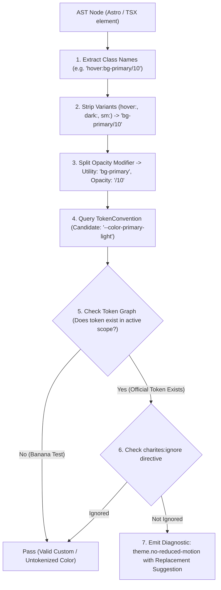
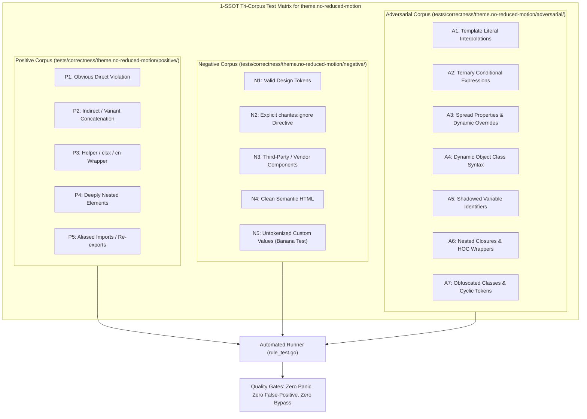

# theme.no-reduced-motion

> **Rule ID:** `theme.no-reduced-motion`
> **Severity:** `WARN`
> **Category:** `theme`
> **Target Standards:** WCAG 2.2 Success Criterion 2.3.3 (Animation from Interactions), W3C Media Queries Level 5 (prefers-reduced-motion), Accessible Web Animation & Vestibular Safety Guidelines

---

## 1. Overview & Core Invariant

Detects global theme transitions without prefers-reduced-motion media query wrapping

### Core Invariant:
> **"Global theme and color transitions must be scoped within prefers-reduced-motion: no-preference or mitigated with reduced-motion overrides."**

---
## 2. Technical Grounding & Engine Realities

Smooth CSS transitions applied to root or theme switching (such as * { transition: background-color 0.3s, color 0.3s; } or transition: all 0.2s) can cause dizziness, headaches, and nausea for users with vestibular disorders.

WCAG 2.2 Success Criterion 2.3.3 requires that non-essential animations triggered by user interaction can be turned off or respect system accessibility preferences.

Charites enforces wrapping theme transitions in @media (prefers-reduced-motion: no-preference) or providing an explicit @media (prefers-reduced-motion: reduce) { transition: none; } fallback.

---
## 3. Vulnerability & Risk Taxonomy

| Risk Vector | Severity | Impact |
| :--- | :---: | :--- |
| **Vestibular Distress** | MEDIUM | Rapid or uncontrolled surface transitions induce disorientation or motion sickness for sensitive users. |
| **WCAG 2.2 SC 2.3.3 Non-Compliance** | MEDIUM | Failure to honor OS-level accessibility preferences prevents compliance with regulatory accessibility standards. |

---
## 4. Non-Compliant Code Patterns (Bad Examples)
### ASTRO (Unmitigated global theme transition in Astro style):
```astro
<style>
  * {
    transition: background-color 0.3s ease, color 0.3s ease;
  }
</style>
```
### TSX (Broad transition all without motion preference in TSX):
```tsx
<style>{`
  body {
    transition: all 0.25s ease-in-out;
  }
`}</style>
```

---
## 5. Compliant Implementation Patterns (Good Examples)
### ASTRO (Theme transition scoped to no-preference media query):
```astro
<style>
  @media (prefers-reduced-motion: no-preference) {
    * {
      transition: background-color 0.3s ease, color 0.3s ease;
    }
  }
</style>
```
### ASTRO (Explicit reduced-motion override):
```astro
<style>
  body {
    transition: background-color 0.3s ease;
  }
  @media (prefers-reduced-motion: reduce) {
    body {
      transition: none;
    }
  }
</style>
```

---

## 6. Detection & Verification Pipeline (How The Rule Evaluates Code)
This `theme` rule evaluates source templates against the project's design token graph:



### Step-by-Step Evaluation:
1. **AST Node Traversal:** `internal/analyzer` streams JSX/Astro AST elements to the rule's `Evaluate` visitor.
2. **Variant Normalization:** Strips responsive (`sm:`, `md:`), interaction state (`hover:`, `focus:`), and theme (`dark:`) prefixes to isolate the core utility class.
3. **Modifier Extraction:** Parses utility segments and extracts slash opacity modifiers.
4. **Token Convention Resolution:** Consults the `TokenConvention` adapter to determine the official semantic design token replacement candidate.
5. **Token Graph Verification (Banana Test):** Queries `token.Context` to verify that the candidate token is declared in `global.css` or `tokens.json` within the element's scope. If not declared, the custom value is permitted without a false-positive diagnostic.
6. **Directive Suppression Check:** Inspects preceding AST comments for `charites:ignore theme.no-reduced-motion`.
7. **Diagnostic Emission:** Produces a structured diagnostic with line number, column span, and actionable replacement suggestion.

---

## 7. Verification & Test Harness (How The Test Works: 1-SSOT Tri-Corpus)

This rule is rigorously tested and validated across the canonical **1-SSOT Tri-Corpus** in `tests/correctness/theme.no-reduced-motion/`:



- **Positive Fixtures (P1-P5):** Verified to trigger diagnostics at exact lines and column spans.
- **Negative Fixtures (N1-N5):** Verified to produce zero diagnostics on valid tokens and legitimate exemptions.
- **Adversarial Fixtures (A1-A7):** Verified to prevent evasion across dynamic expressions, string interpolations, and cyclic references.

---

## 8. How to Suppress (Ignore Directives)

If this pattern is required for an intentional exception, suppress the diagnostic using the canonical Charites Rule ID:

```astro
<!-- charites:ignore theme.no-reduced-motion intentional exception -->
```

```tsx
// charites:ignore theme.no-reduced-motion intentional exception
```

---

## 9. Configuration Reference (`charites.yaml`)

```yaml
rules:
  theme.no-reduced-motion:
    severity: warn # error | warn | info | off
```

