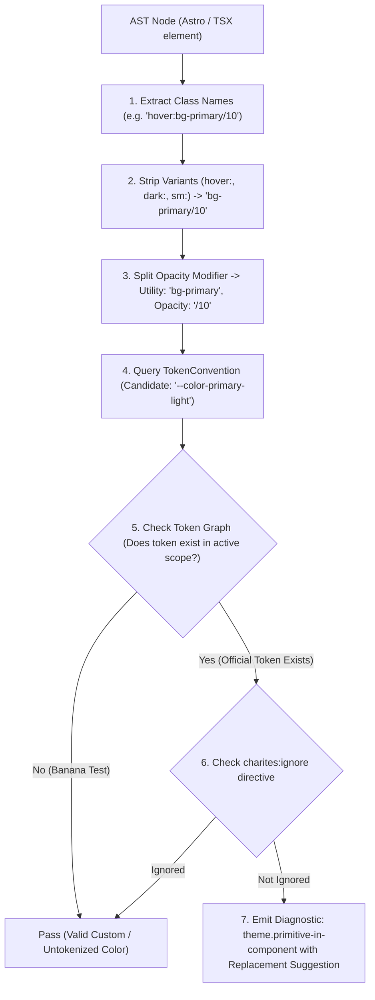
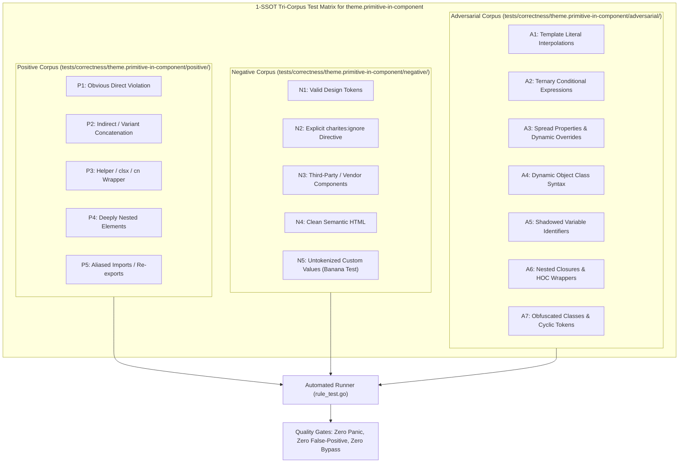

# theme.primitive-in-component

> **Rule ID:** `theme.primitive-in-component`
> **Severity:** `ERROR`
> **Category:** `theme`
> **Target Standards:** W3C Design Tokens Community Group (DTCG) 3-Tier Architecture, Tailwind CSS Design Token Architecture

---

## 1. Overview & Core Invariant

Detects direct usage of Tailwind primitive palette colors in component classes instead of semantic tokens

### Core Invariant:
> **"UI components must consume Tier 2 Semantic Tokens (e.g. bg-primary, text-muted-foreground), never Tier 1 Primitive Palette tokens directly."**

---
## 2. Technical Grounding & Engine Realities

The W3C Design Tokens Community Group establishes a 3-tier hierarchy:

1. Tier 1 (Primitive/Base): Raw palette colors (blue-600, slate-800) defining available color DNA.
2. Tier 2 (Semantic/Alias): Role-based intents (primary, destructive, card, muted) that map differently across themes.
3. Tier 3 (Component-Specific): Optional scoped overrides.

When components consume Tier 1 colors directly:
- Dark mode parity breaks because blue-600 has no semantic relationship to surface contrast.
- Multi-tenant white-labeling is impossible without modifying every template.
- Intent is lost: a developer cannot tell if blue-600 represents an interactive action, info state, or brand accent.

---
## 3. Vulnerability & Risk Taxonomy

| Risk Vector | Severity | Impact |
| :--- | :---: | :--- |
| **Broken Dark Mode** | HIGH | Components with hardcoded primitive colors fail to invert or adapt when switching between light and dark modes. |
| **Architectural Decay** | HIGH | Violating DTCG token layering forces ad-hoc overrides, leading to widespread design debt. |

---
## 4. Non-Compliant Code Patterns (Bad Examples)
### ASTRO (Direct primitive colors in button):
```astro
<button class="bg-blue-600 hover:bg-blue-700 text-white">Submit</button>
```
### TSX (Primitive text and border colors in card):
```tsx
export function Card() {
  return <div className="border-gray-200 text-slate-800 bg-zinc-50">Content</div>;
}
```

---
## 5. Compliant Implementation Patterns (Good Examples)
### ASTRO (Semantic tokens mapped from global.css):
```astro
<button class="bg-primary hover:bg-primary/90 text-primary-foreground">Submit</button>
```
### TSX (Semantic tokens for theme consistency):
```tsx
export function Card() {
  return <div className="border-border text-card-foreground bg-card">Content</div>;
}
```

---

## 6. Detection & Verification Pipeline (How The Rule Evaluates Code)
This `theme` rule evaluates source templates against the project's design token graph:



### Step-by-Step Evaluation:
1. **AST Node Traversal:** `internal/analyzer` streams JSX/Astro AST elements to the rule's `Evaluate` visitor.
2. **Variant Normalization:** Strips responsive (`sm:`, `md:`), interaction state (`hover:`, `focus:`), and theme (`dark:`) prefixes to isolate the core utility class.
3. **Modifier Extraction:** Parses utility segments and extracts slash opacity modifiers.
4. **Token Convention Resolution:** Consults the `TokenConvention` adapter to determine the official semantic design token replacement candidate.
5. **Token Graph Verification (Banana Test):** Queries `token.Context` to verify that the candidate token is declared in `global.css` or `tokens.json` within the element's scope. If not declared, the custom value is permitted without a false-positive diagnostic.
6. **Directive Suppression Check:** Inspects preceding AST comments for `charites:ignore theme.primitive-in-component`.
7. **Diagnostic Emission:** Produces a structured diagnostic with line number, column span, and actionable replacement suggestion.

---

## 7. Verification & Test Harness (How The Test Works: 1-SSOT Tri-Corpus)

This rule is rigorously tested and validated across the canonical **1-SSOT Tri-Corpus** in `tests/correctness/theme.primitive-in-component/`:



- **Positive Fixtures (P1-P5):** Verified to trigger diagnostics at exact lines and column spans.
- **Negative Fixtures (N1-N5):** Verified to produce zero diagnostics on valid tokens and legitimate exemptions.
- **Adversarial Fixtures (A1-A7):** Verified to prevent evasion across dynamic expressions, string interpolations, and cyclic references.

---

## 8. How to Suppress (Ignore Directives)

If this pattern is required for an intentional exception, suppress the diagnostic using the canonical Charites Rule ID:

```astro
<!-- charites:ignore theme.primitive-in-component intentional exception -->
```

```tsx
// charites:ignore theme.primitive-in-component intentional exception
```

---

## 9. Configuration Reference (`charites.yaml`)

```yaml
rules:
  theme.primitive-in-component:
    severity: error # error | warn | info | off
```

