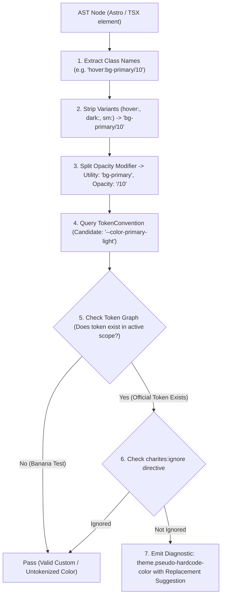
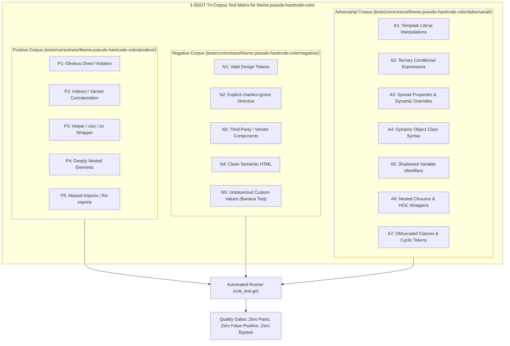

# theme.pseudo-hardcode-color

> **Rule ID:** `theme.pseudo-hardcode-color`
> **Severity:** `WARN`
> **Category:** `theme`
> **Target Standards:** W3C Design Tokens Community Group (DTCG), Tailwind CSS Pseudo-Element Architecture

---

## 1. Overview & Core Invariant

Detects hardcoded primitive, arbitrary hex, or monochrome colors inside pseudo-element and pseudo-class variants

### Core Invariant:
> **"Pseudo-elements (placeholder, selection, file, marker) must consume semantic tokens, never raw primitive or arbitrary colors."**

---
## 2. Technical Grounding & Engine Realities

Pseudo-element styling often slips past generic linters that only inspect top-level classes.

When developers specify placeholder:text-gray-400 or selection:bg-blue-200:
1. Input Readability Degradation: A placeholder styled with light gray-400 becomes completely invisible on light input surfaces or garish on dark inputs.
2. Selection Contrast Clashes: Static blue-200 selection background can fail WCAG contrast against the text color in dark mode.
3. Inconsistent State Branding: File inputs and list markers fail to reflect global theme tokens.

Charites enforces using semantic tokens (placeholder:text-muted-foreground, selection:bg-primary-light).

---
## 3. Vulnerability & Risk Taxonomy

| Risk Vector | Severity | Impact |
| :--- | :---: | :--- |
| **Form Accessibility Failure** | HIGH | Low-contrast placeholder text fails WCAG minimum ratio, making form inputs confusing for users. |
| **Selection Highlight Glitch** | MEDIUM | Hardcoded selection backgrounds obliterate text visibility under dark themes. |

---
## 4. Non-Compliant Code Patterns (Bad Examples)
### ASTRO (Hardcoded primitive colors in placeholder and selection):
```astro
<input class="placeholder:text-gray-400 selection:bg-blue-200" />
```
### TSX (Arbitrary hex in pseudo variants):
```tsx
export function Input() {
  return <input className="placeholder:text-[#94a3b8] file:bg-slate-100" />;
}
```

---
## 5. Compliant Implementation Patterns (Good Examples)
### ASTRO (Semantic tokens for pseudo styling):
```astro
<input class="placeholder:text-muted-foreground selection:bg-primary-light" />
```
### TSX (Semantic tokens adapting to active theme):
```tsx
export function Input() {
  return <input className="placeholder:text-muted-foreground file:bg-secondary" />;
}
```

---

## 6. Detection & Verification Pipeline (How The Rule Evaluates Code)
This `theme` rule evaluates source templates against the project's design token graph:



### Step-by-Step Evaluation:
1. **AST Node Traversal:** `internal/analyzer` streams JSX/Astro AST elements to the rule's `Evaluate` visitor.
2. **Variant Normalization:** Strips responsive (`sm:`, `md:`), interaction state (`hover:`, `focus:`), and theme (`dark:`) prefixes to isolate the core utility class.
3. **Modifier Extraction:** Parses utility segments and extracts slash opacity modifiers.
4. **Token Convention Resolution:** Consults the `TokenConvention` adapter to determine the official semantic design token replacement candidate.
5. **Token Graph Verification (Banana Test):** Queries `token.Context` to verify that the candidate token is declared in `global.css` or `tokens.json` within the element's scope. If not declared, the custom value is permitted without a false-positive diagnostic.
6. **Directive Suppression Check:** Inspects preceding AST comments for `charites:ignore theme.pseudo-hardcode-color`.
7. **Diagnostic Emission:** Produces a structured diagnostic with line number, column span, and actionable replacement suggestion.

---

## 7. Verification & Test Harness (How The Test Works: 1-SSOT Tri-Corpus)

This rule is rigorously tested and validated across the canonical **1-SSOT Tri-Corpus** in `tests/correctness/theme.pseudo-hardcode-color/`:



- **Positive Fixtures (P1-P5):** Verified to trigger diagnostics at exact lines and column spans.
- **Negative Fixtures (N1-N5):** Verified to produce zero diagnostics on valid tokens and legitimate exemptions.
- **Adversarial Fixtures (A1-A7):** Verified to prevent evasion across dynamic expressions, string interpolations, and cyclic references.

---

## 8. How to Suppress (Ignore Directives)

If this pattern is required for an intentional exception, suppress the diagnostic using the canonical Charites Rule ID:

```astro
<!-- charites:ignore theme.pseudo-hardcode-color intentional exception -->
```

```tsx
// charites:ignore theme.pseudo-hardcode-color intentional exception
```

---

## 9. Configuration Reference (`charites.yaml`)

```yaml
rules:
  theme.pseudo-hardcode-color:
    severity: warn # error | warn | info | off
```

