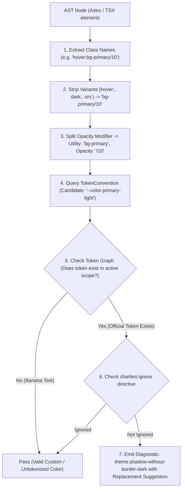
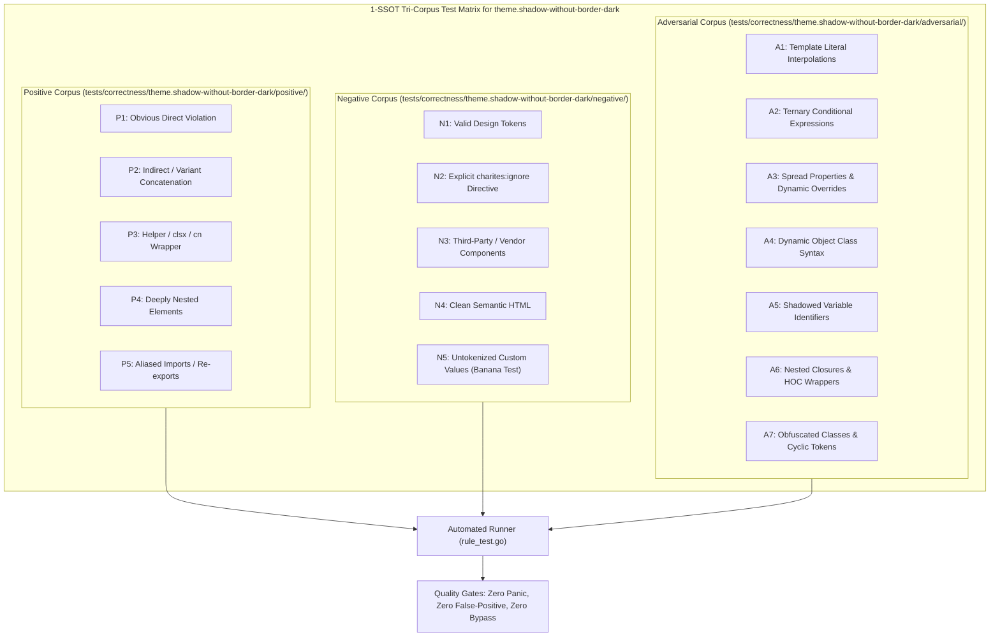

# theme.shadow-without-border-dark

> **Rule ID:** `theme.shadow-without-border-dark`
> **Severity:** `WARN`
> **Category:** `theme`
> **Target Standards:** Material Design 3 Elevation Guidelines, W3C DTCG Elevation & Shadow Tokens, Dark Mode Optical Physics & Surface Boundaries

---

## 1. Overview & Core Invariant

Detects elevated containers with shadow lacking border or ring indicators in dark mode

### Core Invariant:
> **"Elevated containers in dark mode must include a border or ring to maintain boundary perception against dark canvas backgrounds."**

---
## 2. Technical Grounding & Engine Realities

In dark mode, standard drop shadows (e.g. shadow-md, shadow-lg, shadow-xl) vanish because black alpha shadows cannot produce luminance contrast against dark or black canvases (optical shadow collapse):

1. Boundary Disappearance: High-elevation dialogs, popovers, and cards visually merge into the background canvas.
2. Loss of Spatial Hierarchy: Users lose depth perception and cannot distinguish foreground cards from background sections.
3. Inconsistent Multi-Theme UX: Interfaces that look well-separated in light mode become an unsegmented flat surface in dark mode.

Charites enforces pairing elevated shadows with subtle boundary tokens (e.g. border border-border or ring-1 ring-border).

---
## 3. Vulnerability & Risk Taxonomy

| Risk Vector | Severity | Impact |
| :--- | :---: | :--- |
| **Dark Mode Shadow Collapse** | MEDIUM | Elevated elements blend completely into background surfaces in dark themes, eliminating depth cues. |
| **Spatial Hierarchy Degradation** | MEDIUM | Users experience layout confusion between distinct interactive surfaces and parent containers. |

---
## 4. Non-Compliant Code Patterns (Bad Examples)
### TSX (Elevated card using shadow-xl without border boundary):
```tsx
<div className="bg-card shadow-xl rounded-xl p-6">Modal Dialog</div>
```
### ASTRO (High-elevation floating panel without border or ring):
```astro
<div class="shadow-lg rounded-2xl bg-zinc-900 p-4">Floating Panel</div>
```

---
## 5. Compliant Implementation Patterns (Good Examples)
### TSX (Elevated card reinforced with border-border boundary):
```tsx
<div className="bg-card border border-border shadow-xl rounded-xl p-6">Modal Dialog</div>
```
### ASTRO (Elevated panel reinforced with ring token):
```astro
<div class="shadow-lg ring-1 ring-border rounded-2xl bg-zinc-900 p-4">Floating Panel</div>
```

---

## 6. Detection & Verification Pipeline (How The Rule Evaluates Code)
This `theme` rule evaluates source templates against the project's design token graph:



### Step-by-Step Evaluation:
1. **AST Node Traversal:** `internal/analyzer` streams JSX/Astro AST elements to the rule's `Evaluate` visitor.
2. **Variant Normalization:** Strips responsive (`sm:`, `md:`), interaction state (`hover:`, `focus:`), and theme (`dark:`) prefixes to isolate the core utility class.
3. **Modifier Extraction:** Parses utility segments and extracts slash opacity modifiers.
4. **Token Convention Resolution:** Consults the `TokenConvention` adapter to determine the official semantic design token replacement candidate.
5. **Token Graph Verification (Banana Test):** Queries `token.Context` to verify that the candidate token is declared in `global.css` or `tokens.json` within the element's scope. If not declared, the custom value is permitted without a false-positive diagnostic.
6. **Directive Suppression Check:** Inspects preceding AST comments for `charites:ignore theme.shadow-without-border-dark`.
7. **Diagnostic Emission:** Produces a structured diagnostic with line number, column span, and actionable replacement suggestion.

---

## 7. Verification & Test Harness (How The Test Works: 1-SSOT Tri-Corpus)

This rule is rigorously tested and validated across the canonical **1-SSOT Tri-Corpus** in `tests/correctness/theme.shadow-without-border-dark/`:



- **Positive Fixtures (P1-P5):** Verified to trigger diagnostics at exact lines and column spans.
- **Negative Fixtures (N1-N5):** Verified to produce zero diagnostics on valid tokens and legitimate exemptions.
- **Adversarial Fixtures (A1-A7):** Verified to prevent evasion across dynamic expressions, string interpolations, and cyclic references.

---

## 8. How to Suppress (Ignore Directives)

If this pattern is required for an intentional exception, suppress the diagnostic using the canonical Charites Rule ID:

```astro
<!-- charites:ignore theme.shadow-without-border-dark intentional exception -->
```

```tsx
// charites:ignore theme.shadow-without-border-dark intentional exception
```

---

## 9. Configuration Reference (`charites.yaml`)

```yaml
rules:
  theme.shadow-without-border-dark:
    severity: warn # error | warn | info | off
```

