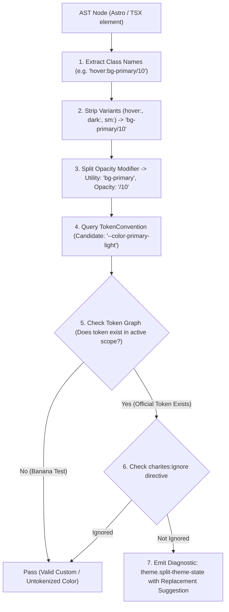
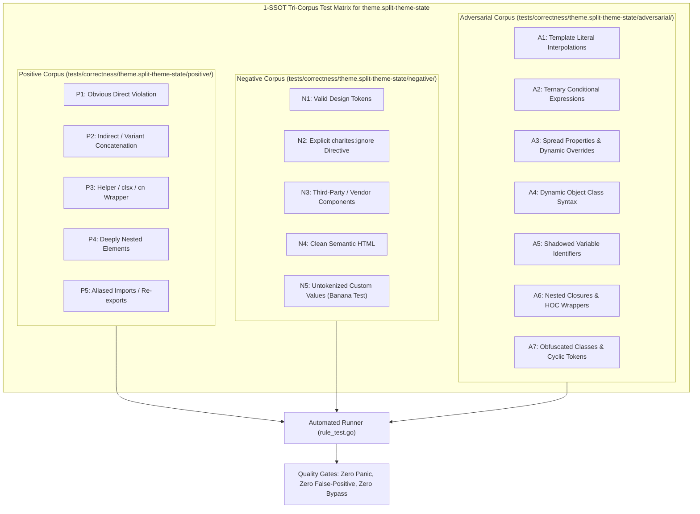

# theme.split-theme-state

> **Rule ID:** `theme.split-theme-state`
> **Severity:** `WARN`
> **Category:** `theme`
> **Target Standards:** Design System Single Source of Truth (SSOT) Architecture, React State Management Best Practices (Context & Hooks), WCAG 2.2 Predictable Navigation & Consistency

---

## 1. Overview & Core Invariant

Detects ad-hoc direct access to theme state via localStorage outside ThemeProvider

### Core Invariant:
> **"Component UI state must consume theme through a unified ThemeProvider context or custom hook, never querying localStorage directly in component bodies or handlers."**

---
## 2. Technical Grounding & Engine Realities

When developers directly access or mutate localStorage.getItem('theme') or localStorage.theme in scattered components:

1. Fragmented State: Component A reads localStorage while Component B listens to React Context, causing disparate parts of the UI to display inconsistent themes.
2. Missing Reactivity: Updates directly to localStorage do not trigger React or framework re-renders across sibling components.
3. Testability Breakdown: Components cannot be unit tested or rendered in isolation without mocking global browser APIs.

Charites enforces routing all theme state access through a unified Theme Provider / useTheme hook, permitting direct localStorage access only in root <head> bootstrap scripts.

---
## 3. Vulnerability & Risk Taxonomy

| Risk Vector | Severity | Impact |
| :--- | :---: | :--- |
| **Theme Desynchronization Across UI** | MEDIUM | Different page regions display discordant color schemes due to uncoordinated local state reads. |
| **Broken Component Reactivity** | MEDIUM | Theme switches fail to re-render affected components without a full browser page refresh. |

---
## 4. Non-Compliant Code Patterns (Bad Examples)
### TSX (Direct localStorage mutation in button onClick handler):
```tsx
<button onClick={() => localStorage.setItem('theme', 'dark')}>Toggle</button>
```
### ASTRO (Direct localStorage inspection in Astro component body):
```astro
<div data-theme={localStorage.getItem('theme')}>Container</div>
```

---
## 5. Compliant Implementation Patterns (Good Examples)
### TSX (Using unified useTheme hook from ThemeProvider):
```tsx
const { theme, setTheme } = useTheme();
<button onClick={() => setTheme(theme === 'dark' ? 'light' : 'dark')}>Toggle</button>
```
### ASTRO (Permitted inline bootstrap script inside root <head>):
```astro
<head>
  <script is:inline>
    const theme = localStorage.getItem('theme') || 'light';
    document.documentElement.classList.toggle('dark', theme === 'dark');
  </script>
</head>
```

---

## 6. Detection & Verification Pipeline (How The Rule Evaluates Code)
This `theme` rule evaluates source templates against the project's design token graph:



### Step-by-Step Evaluation:
1. **AST Node Traversal:** `internal/analyzer` streams JSX/Astro AST elements to the rule's `Evaluate` visitor.
2. **Variant Normalization:** Strips responsive (`sm:`, `md:`), interaction state (`hover:`, `focus:`), and theme (`dark:`) prefixes to isolate the core utility class.
3. **Modifier Extraction:** Parses utility segments and extracts slash opacity modifiers.
4. **Token Convention Resolution:** Consults the `TokenConvention` adapter to determine the official semantic design token replacement candidate.
5. **Token Graph Verification (Banana Test):** Queries `token.Context` to verify that the candidate token is declared in `global.css` or `tokens.json` within the element's scope. If not declared, the custom value is permitted without a false-positive diagnostic.
6. **Directive Suppression Check:** Inspects preceding AST comments for `charites:ignore theme.split-theme-state`.
7. **Diagnostic Emission:** Produces a structured diagnostic with line number, column span, and actionable replacement suggestion.

---

## 7. Verification & Test Harness (How The Test Works: 1-SSOT Tri-Corpus)

This rule is rigorously tested and validated across the canonical **1-SSOT Tri-Corpus** in `tests/correctness/theme.split-theme-state/`:



- **Positive Fixtures (P1-P5):** Verified to trigger diagnostics at exact lines and column spans.
- **Negative Fixtures (N1-N5):** Verified to produce zero diagnostics on valid tokens and legitimate exemptions.
- **Adversarial Fixtures (A1-A7):** Verified to prevent evasion across dynamic expressions, string interpolations, and cyclic references.

---

## 8. How to Suppress (Ignore Directives)

If this pattern is required for an intentional exception, suppress the diagnostic using the canonical Charites Rule ID:

```astro
<!-- charites:ignore theme.split-theme-state intentional exception -->
```

```tsx
// charites:ignore theme.split-theme-state intentional exception
```

---

## 9. Configuration Reference (`charites.yaml`)

```yaml
rules:
  theme.split-theme-state:
    severity: warn # error | warn | info | off
```

