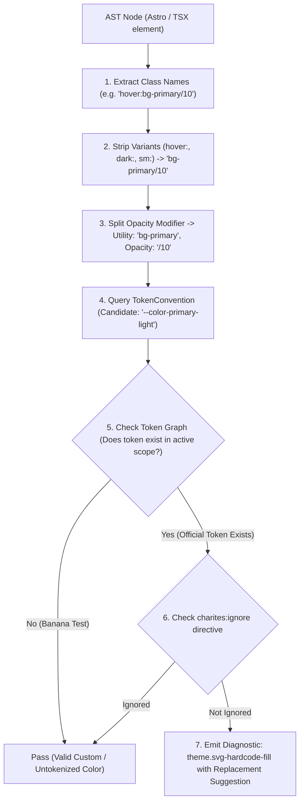
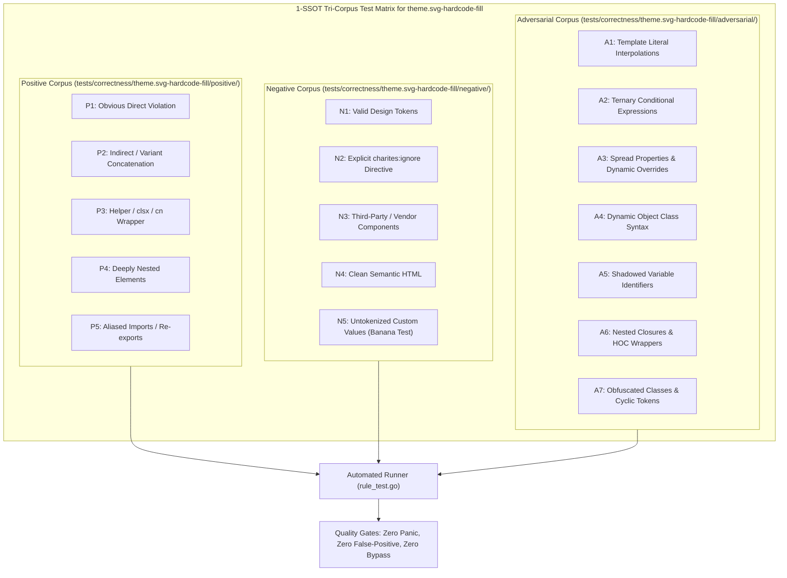

# theme.svg-hardcode-fill

> **Rule ID:** `theme.svg-hardcode-fill`
> **Severity:** `WARN`
> **Category:** `theme`
> **Target Standards:** W3C SVG 2 Specification (Styling & currentColor), WCAG 2.2 Success Criterion 1.4.11 (Non-text Contrast), Design System Scalable Iconography Architecture

---

## 1. Overview & Core Invariant

Detects hardcoded color attributes on SVG markup preventing theme adaptation

### Core Invariant:
> **"SVG vector elements must inherit colors dynamically via currentColor or semantic CSS variables, never hardcoded hex or primitive colors."**

---
## 2. Technical Grounding & Engine Realities

Directly hardcoding raw colors onto SVG elements (such as <path fill="#000000"> or <stop stop-color="#3b82f6">) locks graphics to a static palette:

1. Theme Blindness: Dark icons with fill="#000" vanish when the user toggles dark mode.
2. Inverted Hover/Active States: Hardcoded stroke attributes prevent buttons and navigation links from changing icon color on hover or focus.
3. Reusability Breakdown: Components cannot share identical SVG glyphs across varying semantic surfaces without duplicating markup.

Charites enforces dynamic inheritance using fill="currentColor", stroke="currentColor", or semantic design tokens (var(--primary)).

---
## 3. Vulnerability & Risk Taxonomy

| Risk Vector | Severity | Impact |
| :--- | :---: | :--- |
| **Dark Mode Icon Invisibility** | HIGH | Vector icons hardcoded to black or dark shades become completely invisible against dark backgrounds. |
| **Broken State Affordance** | MEDIUM | Icons fail to inherit hover, focus, and disabled states from parent interactive components. |

---
## 4. Non-Compliant Code Patterns (Bad Examples)
### TSX (Hardcoded hex fill on SVG path in TSX):
```tsx
<path fill="#000000" d="M10 10 H 90 V 90 H 10 Z" />
```
### ASTRO (Primitive hex stop-color and stroke in Astro SVG):
```astro
<svg viewBox="0 0 100 100">
  <stop stop-color="#3b82f6" offset="100%" />
  <circle cx="50" cy="50" r="40" stroke="#ef4444" fill="none" />
</svg>
```

---
## 5. Compliant Implementation Patterns (Good Examples)
### TSX (Adaptive currentColor fill in TSX):
```tsx
<path fill="currentColor" d="M10 10 H 90 V 90 H 10 Z" />
```
### ASTRO (Dynamic CSS variable in gradient stop and currentColor stroke):
```astro
<svg viewBox="0 0 100 100">
  <stop stop-color="var(--primary)" offset="100%" />
  <circle cx="50" cy="50" r="40" stroke="currentColor" fill="none" />
</svg>
```

---

## 6. Detection & Verification Pipeline (How The Rule Evaluates Code)
This `theme` rule evaluates source templates against the project's design token graph:



### Step-by-Step Evaluation:
1. **AST Node Traversal:** `internal/analyzer` streams JSX/Astro AST elements to the rule's `Evaluate` visitor.
2. **Variant Normalization:** Strips responsive (`sm:`, `md:`), interaction state (`hover:`, `focus:`), and theme (`dark:`) prefixes to isolate the core utility class.
3. **Modifier Extraction:** Parses utility segments and extracts slash opacity modifiers.
4. **Token Convention Resolution:** Consults the `TokenConvention` adapter to determine the official semantic design token replacement candidate.
5. **Token Graph Verification (Banana Test):** Queries `token.Context` to verify that the candidate token is declared in `global.css` or `tokens.json` within the element's scope. If not declared, the custom value is permitted without a false-positive diagnostic.
6. **Directive Suppression Check:** Inspects preceding AST comments for `charites:ignore theme.svg-hardcode-fill`.
7. **Diagnostic Emission:** Produces a structured diagnostic with line number, column span, and actionable replacement suggestion.

---

## 7. Verification & Test Harness (How The Test Works: 1-SSOT Tri-Corpus)

This rule is rigorously tested and validated across the canonical **1-SSOT Tri-Corpus** in `tests/correctness/theme.svg-hardcode-fill/`:



- **Positive Fixtures (P1-P5):** Verified to trigger diagnostics at exact lines and column spans.
- **Negative Fixtures (N1-N5):** Verified to produce zero diagnostics on valid tokens and legitimate exemptions.
- **Adversarial Fixtures (A1-A7):** Verified to prevent evasion across dynamic expressions, string interpolations, and cyclic references.

---

## 8. How to Suppress (Ignore Directives)

If this pattern is required for an intentional exception, suppress the diagnostic using the canonical Charites Rule ID:

```astro
<!-- charites:ignore theme.svg-hardcode-fill intentional exception -->
```

```tsx
// charites:ignore theme.svg-hardcode-fill intentional exception
```

---

## 9. Configuration Reference (`charites.yaml`)

```yaml
rules:
  theme.svg-hardcode-fill:
    severity: warn # error | warn | info | off
```

