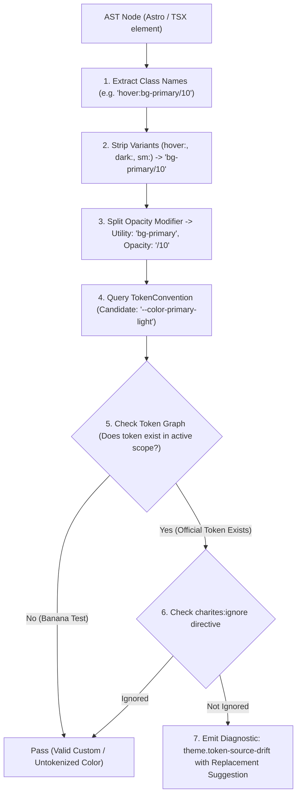
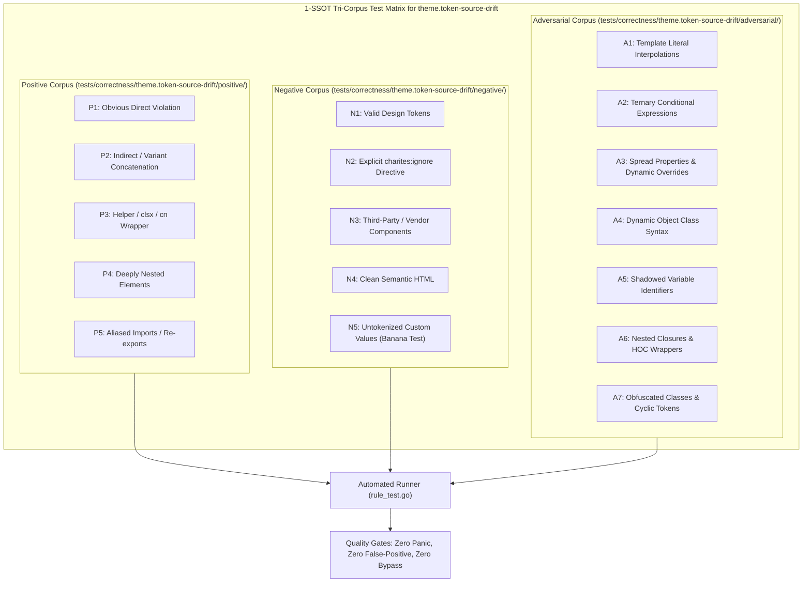

# theme.token-source-drift

> **Rule ID:** `theme.token-source-drift`
> **Severity:** `ERROR`
> **Category:** `theme`
> **Target Standards:** W3C Design Tokens Community Group (DTCG), Single Source of Truth (SSOT) Architecture

---

## 1. Overview & Core Invariant

Detects hardcoded color values bypassing the single source of truth design token pipeline

### Core Invariant:
> **"Custom properties representing theme tokens must not be assigned raw color literals in component scopes; they must resolve to SSOT token references."**

---
## 2. Technical Grounding & Engine Realities

Assigning raw hex/rgb color values directly to theme custom properties inside components or local stylesheets fractures the design token pipeline.

When developers write style="--primary: #2563eb" or declare local --color-brand: #3b82f6:
1. Drift from Global SSOT: The component diverges from centralized theme tokens (global.css), creating fragmented brand colors.
2. Theme Switching Failure: Dynamic theme changes (e.g. high-contrast, dark mode, multi-tenant branding) cannot override local hardcoded values.
3. Design System Audit Blind Spot: Design linters fail to track where rogue colors enter the application.

Charites enforces binding theme variables to global design tokens via var(--...) instead of raw literals.

---
## 3. Vulnerability & Risk Taxonomy

| Risk Vector | Severity | Impact |
| :--- | :---: | :--- |
| **Token SSOT Incoherence** | HIGH | Hardcoded local variable assignments decouple components from global design system updates. |
| **Theme Switch Blind Spot** | HIGH | Local variable assignments prevent dynamic color schemes and tenant styling from cascading. |

---
## 4. Non-Compliant Code Patterns (Bad Examples)
### ASTRO (Hardcoded hex assigned to theme token in inline style):
```astro
<div style="--primary: #2563eb; --background: #ffffff;">Drifting Tokens</div>
```
### TSX (Hardcoded rgb assigned to custom property in JSX style):
```tsx
export function Header() {
  return <header style={{ '--color-brand': 'rgb(37, 99, 235)' }}>Drifted Header</header>;
}
```
### ASTRO (Raw color assigned to theme custom property in style tag):
```astro
<style>
  .card {
    --card-bg: #1e293b;
  }
</style>
```

---
## 5. Compliant Implementation Patterns (Good Examples)
### ASTRO (Theme token mapped via SSOT variable reference):
```astro
<div style="--primary: var(--color-blue-600);">SSOT Aligned</div>
```
### TSX (Non-color numeric custom property):
```tsx
export function Tabs() {
  return <div style={{ '--tab-index': '2' }}>Safe Property</div>;
}
```

---

## 6. Detection & Verification Pipeline (How The Rule Evaluates Code)
This `theme` rule evaluates source templates against the project's design token graph:



### Step-by-Step Evaluation:
1. **AST Node Traversal:** `internal/analyzer` streams JSX/Astro AST elements to the rule's `Evaluate` visitor.
2. **Variant Normalization:** Strips responsive (`sm:`, `md:`), interaction state (`hover:`, `focus:`), and theme (`dark:`) prefixes to isolate the core utility class.
3. **Modifier Extraction:** Parses utility segments and extracts slash opacity modifiers.
4. **Token Convention Resolution:** Consults the `TokenConvention` adapter to determine the official semantic design token replacement candidate.
5. **Token Graph Verification (Banana Test):** Queries `token.Context` to verify that the candidate token is declared in `global.css` or `tokens.json` within the element's scope. If not declared, the custom value is permitted without a false-positive diagnostic.
6. **Directive Suppression Check:** Inspects preceding AST comments for `charites:ignore theme.token-source-drift`.
7. **Diagnostic Emission:** Produces a structured diagnostic with line number, column span, and actionable replacement suggestion.

---

## 7. Verification & Test Harness (How The Test Works: 1-SSOT Tri-Corpus)

This rule is rigorously tested and validated across the canonical **1-SSOT Tri-Corpus** in `tests/correctness/theme.token-source-drift/`:



- **Positive Fixtures (P1-P5):** Verified to trigger diagnostics at exact lines and column spans.
- **Negative Fixtures (N1-N5):** Verified to produce zero diagnostics on valid tokens and legitimate exemptions.
- **Adversarial Fixtures (A1-A7):** Verified to prevent evasion across dynamic expressions, string interpolations, and cyclic references.

---

## 8. How to Suppress (Ignore Directives)

If this pattern is required for an intentional exception, suppress the diagnostic using the canonical Charites Rule ID:

```astro
<!-- charites:ignore theme.token-source-drift intentional exception -->
```

```tsx
// charites:ignore theme.token-source-drift intentional exception
```

---

## 9. Configuration Reference (`charites.yaml`)

```yaml
rules:
  theme.token-source-drift:
    severity: error # error | warn | info | off
```

