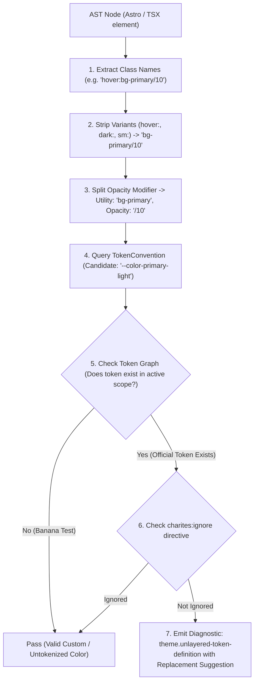
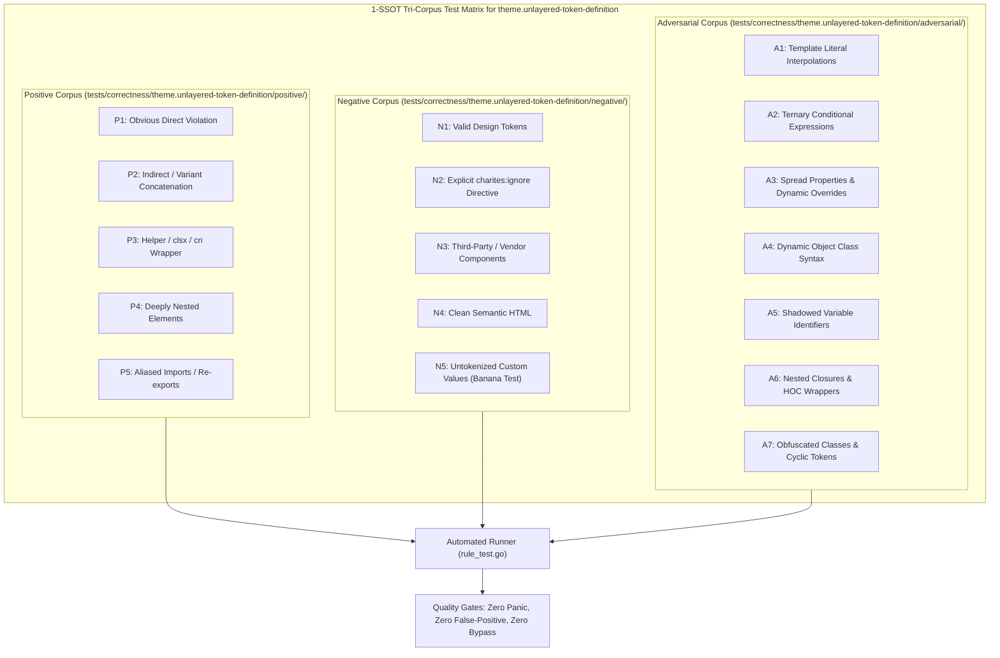

# theme.unlayered-token-definition

> **Rule ID:** `theme.unlayered-token-definition`
> **Severity:** `ERROR`
> **Category:** `theme`
> **Target Standards:** W3C Cascading Style Sheets (CSS) Level 5 (Cascade Layers), W3C CSS Custom Properties for Cascading Variables Module Level 1

---

## 1. Overview & Core Invariant

Detects CSS custom property definitions declared outside @layer theme or @layer base

### Core Invariant:
> **"CSS custom properties representing theme tokens must be declared within @layer theme or @layer base to ensure deterministic cascade resolution."**

---
## 2. Technical Grounding & Engine Realities

In modern frontend architectures and Tailwind CSS v4, unlayered CSS custom properties automatically take precedence over all layered styles regardless of specificity.

When developers declare :root { --primary: #... } without @layer theme or @layer base:
1. Cascade Inversion: Unlayered rules override framework layers and variant cascades unexpectedly.
2. Dark Mode Clashes: Nested dark mode themes defined within layers cannot reliably override unlayered root variables.
3. Specificity Pollution: Subsequent theme overrides require !important or higher specificity hacks to function.

Charites enforces encapsulating theme custom property definitions inside @layer theme or @layer base.

---
## 3. Vulnerability & Risk Taxonomy

| Risk Vector | Severity | Impact |
| :--- | :---: | :--- |
| **Cascade Priority Inversion** | HIGH | Unlayered properties override all cascade layers, preventing dark mode and variant styles from taking effect. |
| **Theme Specificity Escalation** | MEDIUM | Teams resort to !important declarations to override unlayered variables, causing style degradation. |

---
## 4. Non-Compliant Code Patterns (Bad Examples)
### ASTRO (Unlayered :root custom property definition in style tag):
```astro
<style>
  :root {
    --primary: #2563eb;
    --background: #ffffff;
  }
</style>
```
### TSX (Unlayered [data-theme] custom property definition):
```tsx
export function GlobalStyles() {
  return (
    <style>{`
      :root {
        --brand-color: #3b82f6;
      }
    `}</style>
  );
}
```

---
## 5. Compliant Implementation Patterns (Good Examples)
### ASTRO (Enclosed within @layer theme):
```astro
<style>
  @layer theme {
    :root {
      --primary: #2563eb;
      --background: #ffffff;
    }
  }
</style>
```
### ASTRO (Enclosed within @layer base):
```astro
<style>
  @layer base {
    :root {
      --primary: #2563eb;
    }
  }
</style>
```

---

## 6. Detection & Verification Pipeline (How The Rule Evaluates Code)
This `theme` rule evaluates source templates against the project's design token graph:



### Step-by-Step Evaluation:
1. **AST Node Traversal:** `internal/analyzer` streams JSX/Astro AST elements to the rule's `Evaluate` visitor.
2. **Variant Normalization:** Strips responsive (`sm:`, `md:`), interaction state (`hover:`, `focus:`), and theme (`dark:`) prefixes to isolate the core utility class.
3. **Modifier Extraction:** Parses utility segments and extracts slash opacity modifiers.
4. **Token Convention Resolution:** Consults the `TokenConvention` adapter to determine the official semantic design token replacement candidate.
5. **Token Graph Verification (Banana Test):** Queries `token.Context` to verify that the candidate token is declared in `global.css` or `tokens.json` within the element's scope. If not declared, the custom value is permitted without a false-positive diagnostic.
6. **Directive Suppression Check:** Inspects preceding AST comments for `charites:ignore theme.unlayered-token-definition`.
7. **Diagnostic Emission:** Produces a structured diagnostic with line number, column span, and actionable replacement suggestion.

---

## 7. Verification & Test Harness (How The Test Works: 1-SSOT Tri-Corpus)

This rule is rigorously tested and validated across the canonical **1-SSOT Tri-Corpus** in `tests/correctness/theme.unlayered-token-definition/`:



- **Positive Fixtures (P1-P5):** Verified to trigger diagnostics at exact lines and column spans.
- **Negative Fixtures (N1-N5):** Verified to produce zero diagnostics on valid tokens and legitimate exemptions.
- **Adversarial Fixtures (A1-A7):** Verified to prevent evasion across dynamic expressions, string interpolations, and cyclic references.

---

## 8. How to Suppress (Ignore Directives)

If this pattern is required for an intentional exception, suppress the diagnostic using the canonical Charites Rule ID:

```astro
<!-- charites:ignore theme.unlayered-token-definition intentional exception -->
```

```tsx
// charites:ignore theme.unlayered-token-definition intentional exception
```

---

## 9. Configuration Reference (`charites.yaml`)

```yaml
rules:
  theme.unlayered-token-definition:
    severity: error # error | warn | info | off
```

