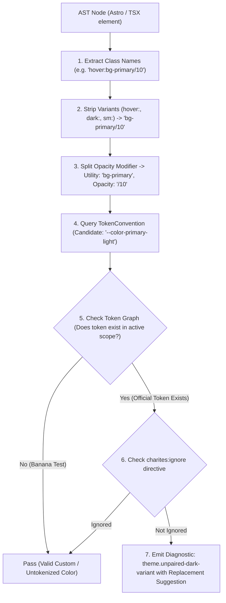
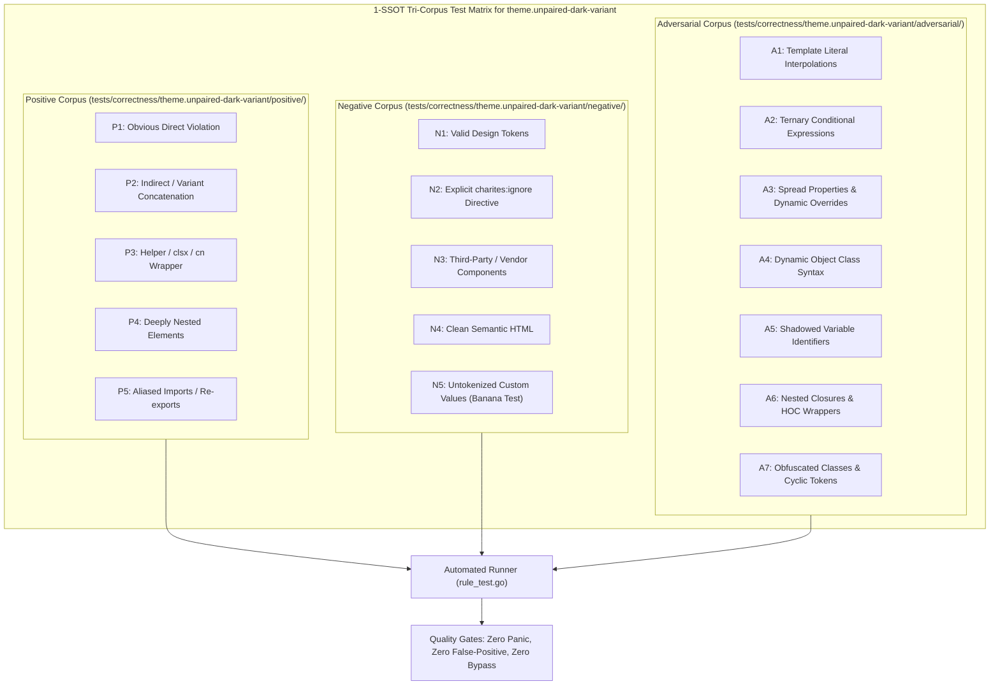

# theme.unpaired-dark-variant

> **Rule ID:** `theme.unpaired-dark-variant`
> **Severity:** `WARN`
> **Category:** `theme`
> **Target Standards:** WCAG 2.2 Success Criterion 1.4.3 (Contrast Minimum), W3C Design Tokens Community Group (DTCG), Tailwind CSS Dark Mode Variant Architecture

---

## 1. Overview & Core Invariant

Detects one-sided dark theme variant declarations causing severe contrast collisions

### Core Invariant:
> **"Background and text theme variants must be paired symmetrically, or use adaptive semantic tokens (bg-card, text-card-foreground) to guarantee contrast."**

---
## 2. Technical Grounding & Engine Realities

Declaring one-sided dark mode classes (such as dark:bg-zinc-900 without a light base background, or inverting container backgrounds without adapting child text colors) causes catastrophic contrast collapses:

1. Black-on-Black Illegibility: An element that inverts to dark:bg-zinc-900 while child text remains text-zinc-900 renders completely unreadable text in dark mode.
2. Incomplete State Inversion: Specifying dark:bg-* without a default bg-* causes unpredictable transparency blending over parent containers.
3. Accessibility Failures: Contrast ratios plummet below 1.5:1, triggering immediate WCAG Level AA and AAA violations.

Charites enforces symmetric pairing (e.g. bg-white dark:bg-zinc-900 with text-zinc-900 dark:text-zinc-100) or using theme-adaptive semantic tokens (bg-card text-card-foreground).

---
## 3. Vulnerability & Risk Taxonomy

| Risk Vector | Severity | Impact |
| :--- | :---: | :--- |
| **Contrast Collapse (Black-on-Black / White-on-White)** | HIGH | Users are unable to read text or interact with controls when switching theme modes. |
| **Theme State Fragmentation** | MEDIUM | Unpaired utility modifiers lead to unpredictable cascading color bugs across nested layouts. |

---
## 4. Non-Compliant Code Patterns (Bad Examples)
### TSX (Container inverts background but child text remains dark-mode blind):
```tsx
<div className="bg-white dark:bg-zinc-900">
  <span className="text-zinc-900">Title</span>
</div>
```
### ASTRO (Unpaired dark background variant without base background):
```astro
<div class="dark:bg-zinc-900"><span>Content</span></div>
```

---
## 5. Compliant Implementation Patterns (Good Examples)
### TSX (Using semantic tokens that adapt automatically across themes):
```tsx
<div className="bg-card text-card-foreground">
  <span>Title</span>
</div>
```
### ASTRO (Symmetrically paired background and text variants):
```astro
<div class="bg-white dark:bg-zinc-900">
  <span class="text-zinc-900 dark:text-zinc-100">Title</span>
</div>
```

---

## 6. Detection & Verification Pipeline (How The Rule Evaluates Code)
This `theme` rule evaluates source templates against the project's design token graph:



### Step-by-Step Evaluation:
1. **AST Node Traversal:** `internal/analyzer` streams JSX/Astro AST elements to the rule's `Evaluate` visitor.
2. **Variant Normalization:** Strips responsive (`sm:`, `md:`), interaction state (`hover:`, `focus:`), and theme (`dark:`) prefixes to isolate the core utility class.
3. **Modifier Extraction:** Parses utility segments and extracts slash opacity modifiers.
4. **Token Convention Resolution:** Consults the `TokenConvention` adapter to determine the official semantic design token replacement candidate.
5. **Token Graph Verification (Banana Test):** Queries `token.Context` to verify that the candidate token is declared in `global.css` or `tokens.json` within the element's scope. If not declared, the custom value is permitted without a false-positive diagnostic.
6. **Directive Suppression Check:** Inspects preceding AST comments for `charites:ignore theme.unpaired-dark-variant`.
7. **Diagnostic Emission:** Produces a structured diagnostic with line number, column span, and actionable replacement suggestion.

---

## 7. Verification & Test Harness (How The Test Works: 1-SSOT Tri-Corpus)

This rule is rigorously tested and validated across the canonical **1-SSOT Tri-Corpus** in `tests/correctness/theme.unpaired-dark-variant/`:



- **Positive Fixtures (P1-P5):** Verified to trigger diagnostics at exact lines and column spans.
- **Negative Fixtures (N1-N5):** Verified to produce zero diagnostics on valid tokens and legitimate exemptions.
- **Adversarial Fixtures (A1-A7):** Verified to prevent evasion across dynamic expressions, string interpolations, and cyclic references.

---

## 8. How to Suppress (Ignore Directives)

If this pattern is required for an intentional exception, suppress the diagnostic using the canonical Charites Rule ID:

```astro
<!-- charites:ignore theme.unpaired-dark-variant intentional exception -->
```

```tsx
// charites:ignore theme.unpaired-dark-variant intentional exception
```

---

## 9. Configuration Reference (`charites.yaml`)

```yaml
rules:
  theme.unpaired-dark-variant:
    severity: warn # error | warn | info | off
```

