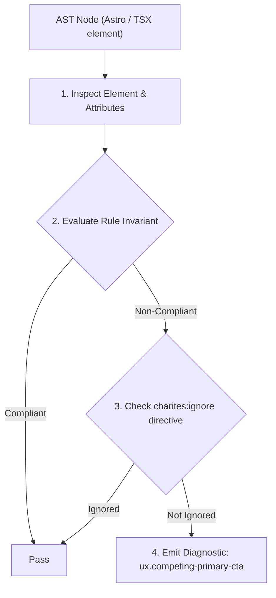
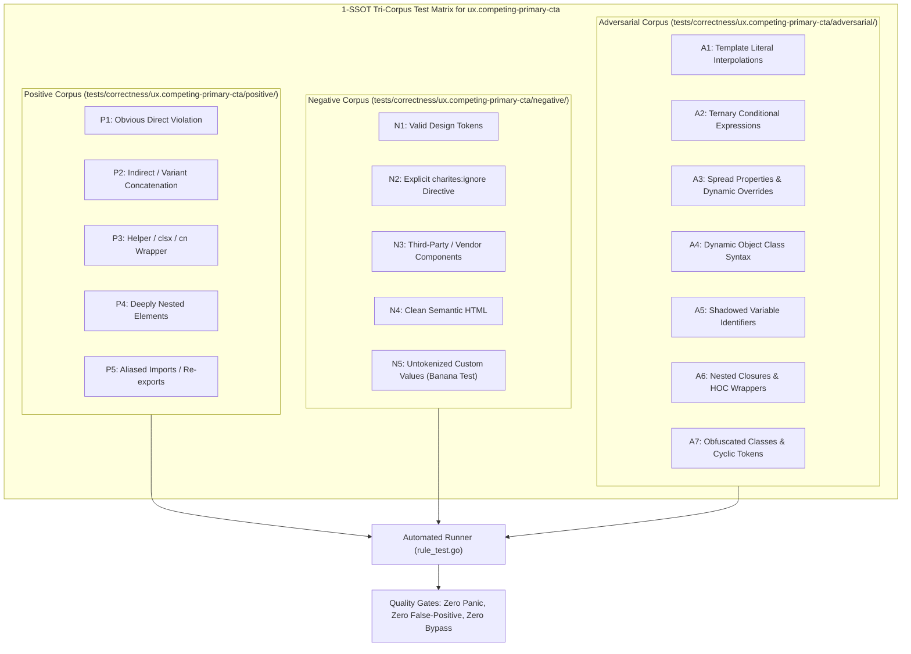

# ux.competing-primary-cta

> **Rule ID:** `ux.competing-primary-cta`
> **Severity:** `WARN`
> **Category:** `ux`
> **Target Standards:** Von Restorff Effect (The Isolation Effect / Visual Dominance), Hick-Hyman Law (Logarithmic Decision Latency), Nielsen Norman Group (Visual Hierarchy for Action Buttons)

---

## 1. Overview & Core Invariant

Warns when an action group or interactive container contains more than one primary call-to-action button

### Core Invariant:
> **"An action container or button group must contain at most one primary call-to-action button, ensuring a clear visual focal point and zero decision ambiguity."**

---
## 2. Technical Grounding & Engine Realities

The Von Restorff Effect (Isolation Effect) predicts that when multiple similar items are presented, the one that differs from the rest is most likely to be remembered and acted upon.

When an interface presents two or more buttons styled identically as primary actions (e.g., two 'bg-primary' or 'variant="primary"' buttons side by side in a modal footer or form actions), visual hierarchy collapses.

This competing prominence causes choice paralysis (Hick-Hyman Law), forces users to pause and re-read labels carefully, and drastically increases the probability of accidental mis-clicks. Every decision context must have exactly one visually distinct primary action, while supporting actions should be styled with 'outline', 'secondary', or 'ghost' variants.

---
## 3. Vulnerability & Risk Taxonomy

| Risk Vector | Severity | Impact |
| :--- | :---: | :--- |
| **Choice Paralysis & Decision Latency** | HIGH | Users hesitate when confronted with equal-weight visual cues, increasing conversion drop-off rates. |
| **Accidental Action Slips** | MEDIUM | Users mistake secondary or cancel triggers for primary confirmation due to identical color and elevation styling. |

---
## 4. Non-Compliant Code Patterns (Bad Examples)
### TSX (Dialog footer with two competing primary buttons creating visual ambiguity):
```tsx
<div className="flex justify-end gap-3 p-4">
  <button type="button" className="bg-primary text-white px-4 py-2 rounded-md">Simpan Draf</button>
  <button type="submit" className="bg-primary text-white px-4 py-2 rounded-md">Publikasikan</button>
</div>
```

---
## 5. Compliant Implementation Patterns (Good Examples)
### TSX (Clear hierarchy: one primary button paired with a secondary outline button):
```tsx
<div className="flex justify-end gap-3 p-4">
  <button type="button" className="border border-input bg-transparent px-4 py-2 rounded-md">Simpan Draf</button>
  <button type="submit" className="bg-primary text-white px-4 py-2 rounded-md">Publikasikan</button>
</div>
```

---

## 6. Detection & Verification Pipeline (How The Rule Evaluates Code)
This rule evaluates source code through the standard AST inspection pipeline:



### Step-by-Step Evaluation:
1. **AST Traversal:** Visits normalized `ir.Node` structures during AST streaming.
2. **Invariant Check:** Compares node attributes against rule invariants.
3. **Directive Suppression Check:** Honors inline `charites:ignore ux.competing-primary-cta` directives.
4. **Diagnostic Emission:** Emits compiler-grade diagnostic on invariant violation.

---

## 7. Verification & Test Harness (How The Test Works: 1-SSOT Tri-Corpus)

This rule is rigorously tested and validated across the canonical **1-SSOT Tri-Corpus** in `tests/correctness/ux.competing-primary-cta/`:



- **Positive Fixtures (P1-P5):** Verified to trigger diagnostics at exact lines and column spans.
- **Negative Fixtures (N1-N5):** Verified to produce zero diagnostics on valid tokens and legitimate exemptions.
- **Adversarial Fixtures (A1-A7):** Verified to prevent evasion across dynamic expressions, string interpolations, and cyclic references.

---

## 8. How to Suppress (Ignore Directives)

If this pattern is required for an intentional exception, suppress the diagnostic using the canonical Charites Rule ID:

```astro
<!-- charites:ignore ux.competing-primary-cta intentional exception -->
```

```tsx
// charites:ignore ux.competing-primary-cta intentional exception
```

---

## 9. Configuration Reference (`charites.yaml`)

```yaml
rules:
  ux.competing-primary-cta:
    severity: warn # error | warn | info | off
```

