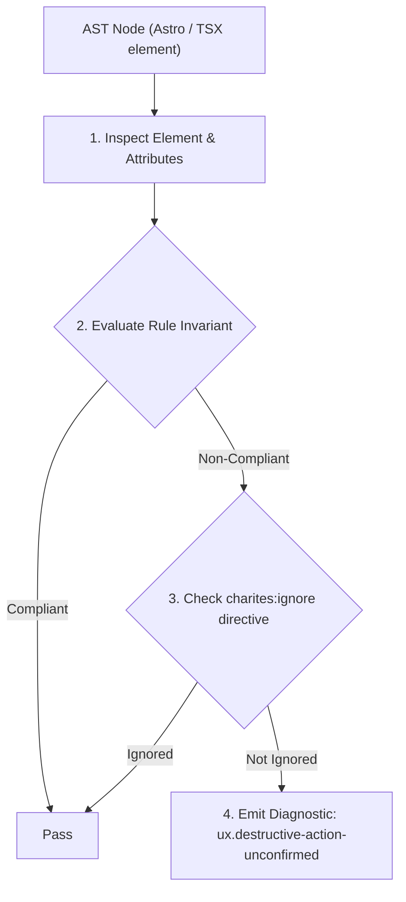
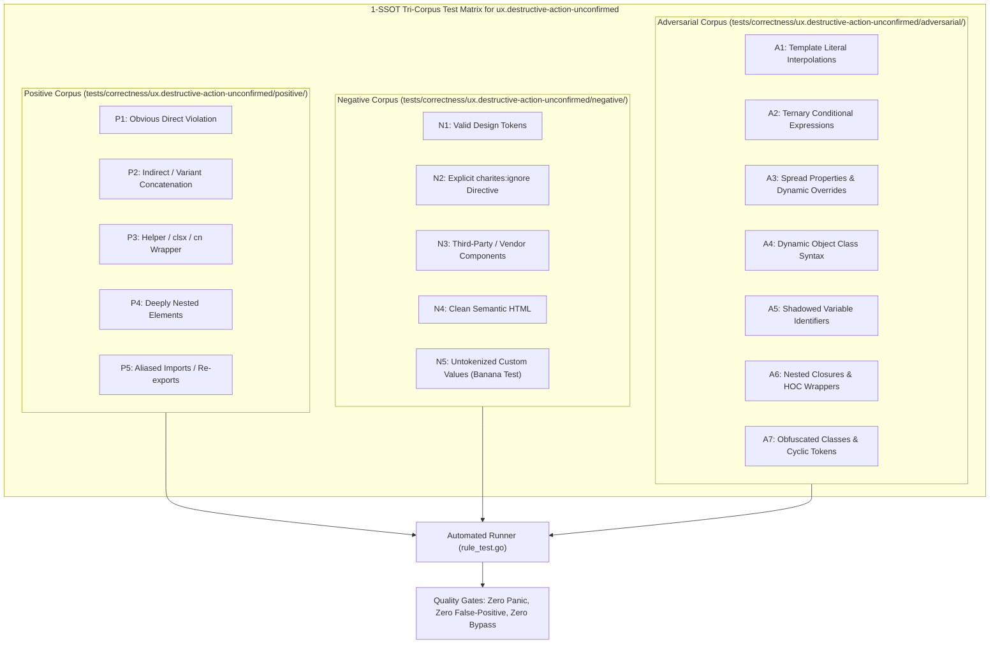

# ux.destructive-action-unconfirmed

> **Rule ID:** `ux.destructive-action-unconfirmed`
> **Severity:** `ERROR`
> **Category:** `ux`
> **Target Standards:** Nielsen Heuristic #5: Error Prevention (Slips and Lapses), ISO 9241-110 Ergonomics of Human-System Interaction (Suitability for the Task), Material Design & WCAG Defensive Action Guidelines

---

## 1. Overview & Core Invariant

Enforces confirmation gating for destructive actions to prevent accidental data loss from slips

### Core Invariant:
> **"Destructive user operations ('delete', 'remove', 'destroy', 'purge', 'revoke') must be gated by a confirmation dialog or 2-step verification."**

---
## 2. Technical Grounding & Engine Realities

Destructive actions such as deleting user accounts, clearing billing databases, or revoking credentials cause permanent, often irreversible data loss.

Executing these operations on a single click without confirmation exposes users to motor slips, touchscreen taps during scrolling, and mistaken identity clicks. Gating destructive actions behind an explicit confirmation dialog (e.g. '<AlertDialog>' or 'window.confirm') provides a cognitive pause and protects against catastrophic slips.

---
## 3. Vulnerability & Risk Taxonomy

| Risk Vector | Severity | Impact |
| :--- | :---: | :--- |
| **Irreversible Data Destruction from Motor Slips** | CRITICAL | Accidental single-click actions immediately wipe critical business data or terminate accounts without user consent. |
| **User Anxiety & Hesitation** | MEDIUM | Users fear interacting with danger-styled buttons when no confirmation boundary protects them from permanent loss. |

---
## 4. Non-Compliant Code Patterns (Bad Examples)
### TSX (Destructive button triggering account deletion directly on single click):
```tsx
<button
  onClick={() => deleteAccount(user.id)}
  className="bg-destructive text-destructive-foreground px-4 py-2 rounded"
>
  Hapus Akun Permanen
</button>
```

---
## 5. Compliant Implementation Patterns (Good Examples)
### TSX (Destructive button safely wrapped in AlertDialogTrigger confirmation modal):
```tsx
<AlertDialogTrigger asChild>
  <button className="bg-destructive text-destructive-foreground px-4 py-2 rounded">
    Hapus Akun Permanen
  </button>
</AlertDialogTrigger>
```

---

## 6. Detection & Verification Pipeline (How The Rule Evaluates Code)
This rule evaluates source code through the standard AST inspection pipeline:



### Step-by-Step Evaluation:
1. **AST Traversal:** Visits normalized `ir.Node` structures during AST streaming.
2. **Invariant Check:** Compares node attributes against rule invariants.
3. **Directive Suppression Check:** Honors inline `charites:ignore ux.destructive-action-unconfirmed` directives.
4. **Diagnostic Emission:** Emits compiler-grade diagnostic on invariant violation.

---

## 7. Verification & Test Harness (How The Test Works: 1-SSOT Tri-Corpus)

This rule is rigorously tested and validated across the canonical **1-SSOT Tri-Corpus** in `tests/correctness/ux.destructive-action-unconfirmed/`:



- **Positive Fixtures (P1-P5):** Verified to trigger diagnostics at exact lines and column spans.
- **Negative Fixtures (N1-N5):** Verified to produce zero diagnostics on valid tokens and legitimate exemptions.
- **Adversarial Fixtures (A1-A7):** Verified to prevent evasion across dynamic expressions, string interpolations, and cyclic references.

---

## 8. How to Suppress (Ignore Directives)

If this pattern is required for an intentional exception, suppress the diagnostic using the canonical Charites Rule ID:

```astro
<!-- charites:ignore ux.destructive-action-unconfirmed intentional exception -->
```

```tsx
// charites:ignore ux.destructive-action-unconfirmed intentional exception
```

---

## 9. Configuration Reference (`charites.yaml`)

```yaml
rules:
  ux.destructive-action-unconfirmed:
    severity: error # error | warn | info | off
```

