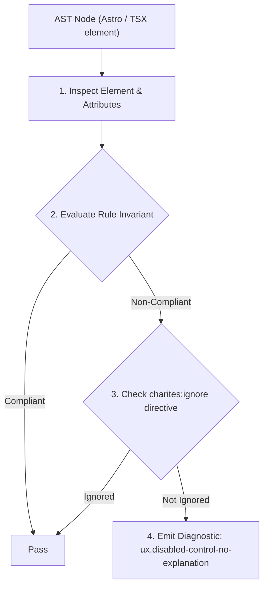
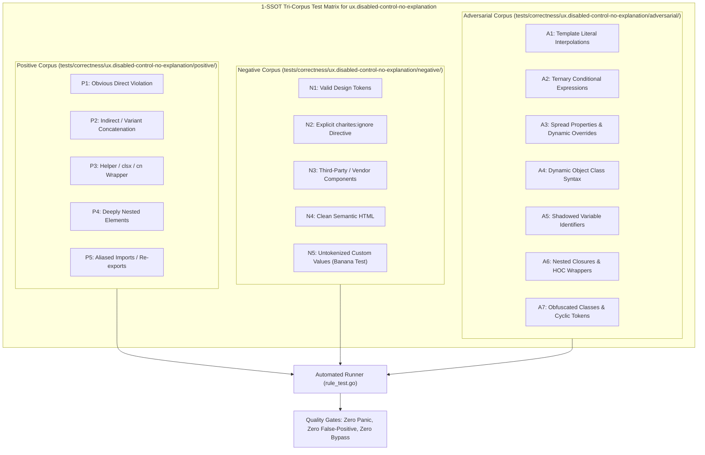

# ux.disabled-control-no-explanation

> **Rule ID:** `ux.disabled-control-no-explanation`
> **Severity:** `WARN`
> **Category:** `ux`
> **Target Standards:** Nielsen Heuristic #1: Visibility of System Status, Feedforward Principle & Gulf of Evaluation (Don Norman), WCAG 2.2 Success Criterion 3.3.2 (Labels or Instructions)

---

## 1. Overview & Core Invariant

Enforces feedforward explanation for disabled interactive controls to prevent user dead ends

### Core Invariant:
> **"Disabled interactive controls ('disabled', 'aria-disabled="true"') must provide a feedforward explanation via 'aria-describedby', tooltip, or visible helper text."**

---
## 2. Technical Grounding & Engine Realities

When users encounter a disabled button or locked form control without any visible reason, they reach a cognitive dead end: they cannot proceed and have no information on how to unlock the action.

Providing contextual feedforward (e.g. 'Minimum belanja Rp 50.000 untuk checkout' or an explanatory tooltip) clarifies system constraints and transforms frustration into actionable user guidance.

---
## 3. Vulnerability & Risk Taxonomy

| Risk Vector | Severity | Impact |
| :--- | :---: | :--- |
| **Cognitive Dead Ends & Workflow Abandonment** | MEDIUM | Users are unable to diagnose why an action is blocked and abandon conversion or submission workflows. |
| **Accessibility Barrier (Screen Reader Confusion)** | MEDIUM | Assisted technology users hear 'button disabled' without auditory explanation of required missing inputs. |

---
## 4. Non-Compliant Code Patterns (Bad Examples)
### TSX (Disabled checkout button without explanation of minimum order constraint):
```tsx
<div className="mt-4">
  <button disabled={cartTotal < 50000} className="bg-primary text-white px-4 py-2 rounded">
    Checkout
  </button>
</div>
```

---
## 5. Compliant Implementation Patterns (Good Examples)
### TSX (Disabled button accompanied by aria-describedby linking to explanatory hint text):
```tsx
<div className="mt-4">
  <button
    disabled={cartTotal < 50000}
    aria-describedby="min-order-hint"
    className="bg-primary text-white px-4 py-2 rounded disabled:opacity-50"
  >
    Checkout
  </button>
  {cartTotal < 50000 && (
    <p id="min-order-hint" className="text-xs text-muted-foreground mt-1">
      Minimum belanja Rp 50.000 untuk melanjutkan checkout.
    </p>
  )}
</div>
```

---

## 6. Detection & Verification Pipeline (How The Rule Evaluates Code)
This rule evaluates source code through the standard AST inspection pipeline:



### Step-by-Step Evaluation:
1. **AST Traversal:** Visits normalized `ir.Node` structures during AST streaming.
2. **Invariant Check:** Compares node attributes against rule invariants.
3. **Directive Suppression Check:** Honors inline `charites:ignore ux.disabled-control-no-explanation` directives.
4. **Diagnostic Emission:** Emits compiler-grade diagnostic on invariant violation.

---

## 7. Verification & Test Harness (How The Test Works: 1-SSOT Tri-Corpus)

This rule is rigorously tested and validated across the canonical **1-SSOT Tri-Corpus** in `tests/correctness/ux.disabled-control-no-explanation/`:



- **Positive Fixtures (P1-P5):** Verified to trigger diagnostics at exact lines and column spans.
- **Negative Fixtures (N1-N5):** Verified to produce zero diagnostics on valid tokens and legitimate exemptions.
- **Adversarial Fixtures (A1-A7):** Verified to prevent evasion across dynamic expressions, string interpolations, and cyclic references.

---

## 8. How to Suppress (Ignore Directives)

If this pattern is required for an intentional exception, suppress the diagnostic using the canonical Charites Rule ID:

```astro
<!-- charites:ignore ux.disabled-control-no-explanation intentional exception -->
```

```tsx
// charites:ignore ux.disabled-control-no-explanation intentional exception
```

---

## 9. Configuration Reference (`charites.yaml`)

```yaml
rules:
  ux.disabled-control-no-explanation:
    severity: warn # error | warn | info | off
```

