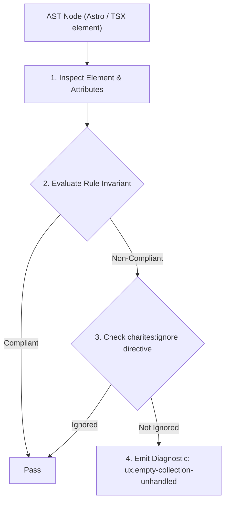
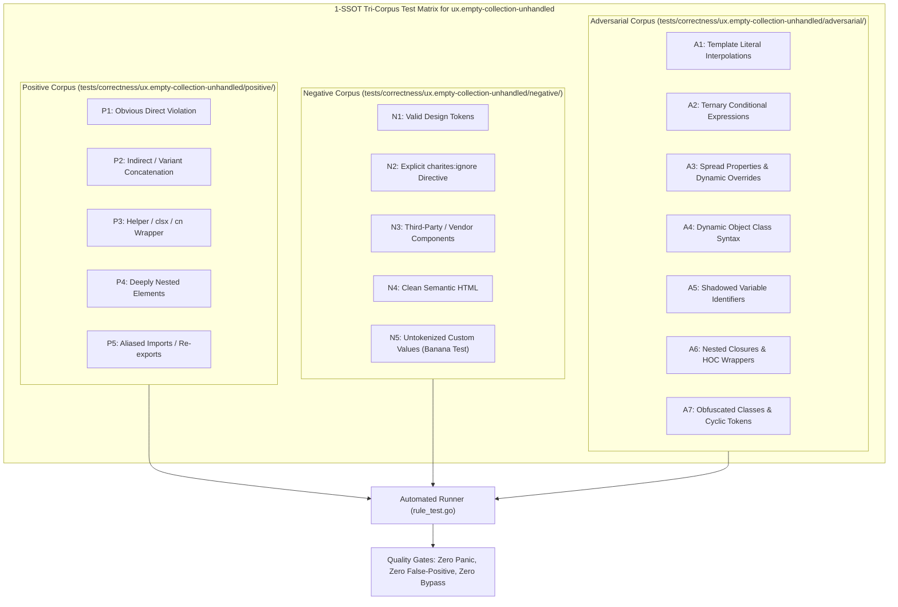

# ux.empty-collection-unhandled

> **Rule ID:** `ux.empty-collection-unhandled`
> **Severity:** `INFO`
> **Category:** `ux`
> **Target Standards:** Zero-State Usability & Mental Model Continuity (Nielsen Norman Group), Feedforward Principle & Gulf of Evaluation (Don Norman), ISO 9241-110 Ergonomics of Human-System Interaction (Suitability for Learning)

---

## 1. Overview & Core Invariant

Advises handling empty collection state when mapping dynamic items to avoid zero-state blindness

### Core Invariant:
> **"Dynamic collection rendering expressions must handle empty collection states ('collection.length === 0') with informative fallback zero-state UI."**

---
## 2. Technical Grounding & Engine Realities

When dynamic lists, tables, or feed collections contain 0 records and render nothing, users are stranded in an ambiguous vacuum: did the request fail, is it still loading, or are there genuinely zero records?

Zero-state blindness forces users to refresh repeatedly or assume the application is broken. A dedicated empty state component (e.g. '<EmptyState />' with an illustration, clarifying text, and a call-to-action button) confirms system status and proactively guides user next steps.

---
## 3. Vulnerability & Risk Taxonomy

| Risk Vector | Severity | Impact |
| :--- | :---: | :--- |
| **Zero-State Blindness & System Status Ambiguity** | LOW | Users perceive blank empty containers as silent application crashes or perpetual loading freezes. |
| **Workflow Dead Ends** | LOW | Without an actionable empty state CTA (e.g. 'Create First Invoice'), users cannot self-discover how to populate the collection. |

---
## 4. Non-Compliant Code Patterns (Bad Examples)
### TSX (Dynamic list rendering items via .map() without handling empty array state):
```tsx
<div className="space-y-3">
  <h2 className="text-lg font-bold">Daftar Tagihan</h2>
  <List items={invoices.map(inv => <InvoiceRow key={inv.id} data={inv} />)} />
</div>
```

---
## 5. Compliant Implementation Patterns (Good Examples)
### TSX (Explicit empty state fallback branch when collection has 0 items):
```tsx
<div className="space-y-3">
  <h2 className="text-lg font-bold">Daftar Tagihan</h2>
  {invoices.length === 0 ? (
    <EmptyState
      title="Belum Ada Tagihan"
      description="Buat tagihan pertama Anda untuk mulai menerima pembayaran."
      actionText="Buat Tagihan"
    />
  ) : (
    <List items={invoices.map(inv => <InvoiceRow key={inv.id} data={inv} />)} />
  )}
</div>
```

---

## 6. Detection & Verification Pipeline (How The Rule Evaluates Code)
This rule evaluates source code through the standard AST inspection pipeline:



### Step-by-Step Evaluation:
1. **AST Traversal:** Visits normalized `ir.Node` structures during AST streaming.
2. **Invariant Check:** Compares node attributes against rule invariants.
3. **Directive Suppression Check:** Honors inline `charites:ignore ux.empty-collection-unhandled` directives.
4. **Diagnostic Emission:** Emits compiler-grade diagnostic on invariant violation.

---

## 7. Verification & Test Harness (How The Test Works: 1-SSOT Tri-Corpus)

This rule is rigorously tested and validated across the canonical **1-SSOT Tri-Corpus** in `tests/correctness/ux.empty-collection-unhandled/`:



- **Positive Fixtures (P1-P5):** Verified to trigger diagnostics at exact lines and column spans.
- **Negative Fixtures (N1-N5):** Verified to produce zero diagnostics on valid tokens and legitimate exemptions.
- **Adversarial Fixtures (A1-A7):** Verified to prevent evasion across dynamic expressions, string interpolations, and cyclic references.

---

## 8. How to Suppress (Ignore Directives)

If this pattern is required for an intentional exception, suppress the diagnostic using the canonical Charites Rule ID:

```astro
<!-- charites:ignore ux.empty-collection-unhandled intentional exception -->
```

```tsx
// charites:ignore ux.empty-collection-unhandled intentional exception
```

---

## 9. Configuration Reference (`charites.yaml`)

```yaml
rules:
  ux.empty-collection-unhandled:
    severity: info # error | warn | info | off
```

