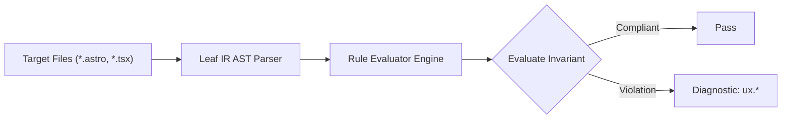

# Ux Rules (`ux`)

The `ux` category contains static analysis rules for code quality, architectural constraints, and design system governance.

---

## Category Rule Index

| Rule ID | Severity | Summary | Full Specification | Status |
| :--- | :---: | :--- | :--- | :---: |
| `ux.camouflaged-link` | `WARN` | Warns when inline prose links rely solely on color without persistent underline or non-color affordance | [`ux.camouflaged-link`](ux.camouflaged-link) | `enabled` |
| `ux.competing-primary-cta` | `WARN` | Warns when an action group or interactive container contains more than one primary call-to-action button | [`ux.competing-primary-cta`](ux.competing-primary-cta) | `enabled` |
| `ux.nav-overflow-chunking` | `WARN` | Warns when a navigation landmark contains more than 7 direct navigation links without chunking mechanisms | [`ux.nav-overflow-chunking`](ux.nav-overflow-chunking) | `enabled` |
| `ux.spacing-inversion` | `WARN` | Warns when child element intra-spacing exceeds parent gap or when space-y conflicts with child mt margin in Tailwind v3 | [`ux.spacing-inversion`](ux.spacing-inversion) | `enabled` |

---
## How the Ux Analysis Pipeline Works

The `ux` engine applies static analysis checks against component source code:

### Pipeline Flow:
1. **AST Node Traversal:** Scans target template files into normalized intermediate representation.
2. **Invariant Assertion:** Validates structural and semantic invariants.
3. **Diagnostic Reporting:** Emits structured diagnostics for non-compliant patterns.

---

## How Ux Tests Work (Verification Harness)

All rules in `ux` are verified using the canonical 1-SSOT Tri-Corpus (`tests/correctness/ux.*/`) encompassing Positive (P1-P5), Negative (N1-N5), and Adversarial (A1-A7) fixture matrices.
