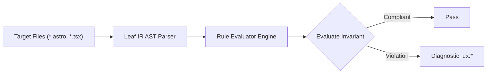

# Ux Rules (`ux`)

The `ux` category contains static analysis rules for code quality, architectural constraints, and design system governance.

---

## Category Rule Index

| Rule ID | Severity | Summary | Full Specification | Status |
| :--- | :---: | :--- | :--- | :---: |
| `ux.camouflaged-link` | `WARN` | Warns when inline prose links rely solely on color without persistent underline or non-color affordance | [`ux.camouflaged-link`](ux.camouflaged-link) | `enabled` |
| `ux.competing-primary-cta` | `WARN` | Warns when an action group or interactive container contains more than one primary call-to-action button | [`ux.competing-primary-cta`](ux.competing-primary-cta) | `enabled` |
| `ux.destructive-action-unconfirmed` | `ERROR` | Enforces confirmation gating for destructive actions to prevent accidental data loss from slips | [`ux.destructive-action-unconfirmed`](ux.destructive-action-unconfirmed) | `enabled` |
| `ux.disabled-control-no-explanation` | `WARN` | Enforces feedforward explanation for disabled interactive controls to prevent user dead ends | [`ux.disabled-control-no-explanation`](ux.disabled-control-no-explanation) | `enabled` |
| `ux.empty-collection-unhandled` | `INFO` | Advises handling empty collection state when mapping dynamic items to avoid zero-state blindness | [`ux.empty-collection-unhandled`](ux.empty-collection-unhandled) | `enabled` |
| `ux.missing-autofill` | `WARN` | Enforces W3C Living Standard autocomplete attributes on personal identity, credential, and payment form inputs (Tesler's Law) | [`ux.missing-autofill`](ux.missing-autofill) | `enabled` |
| `ux.monolithic-form-bloat` | `WARN` | Warns when a monolithic form contains excessive unchunked inputs (> 9 total or > 7 per chunk), violating Cognitive Load Theory | [`ux.monolithic-form-bloat`](ux.monolithic-form-bloat) | `enabled` |
| `ux.nav-overflow-chunking` | `WARN` | Warns when a navigation landmark contains more than 7 direct navigation links without chunking mechanisms | [`ux.nav-overflow-chunking`](ux.nav-overflow-chunking) | `enabled` |
| `ux.orphaned-error-state` | `WARN` | Flags error state updates in event handlers that lack corresponding UI error presentation elements | [`ux.orphaned-error-state`](ux.orphaned-error-state) | `enabled` |
| `ux.radio-overchoice` | `WARN` | Warns when radio groups present excessive flat options (> 7) without filtering or combobox grouping, violating Hick-Hyman Law | [`ux.radio-overchoice`](ux.radio-overchoice) | `enabled` |
| `ux.silent-catch-swallow` | `ERROR` | Detects swallowed catch blocks in event handlers that lack user feedback (toast/alert) or re-throw | [`ux.silent-catch-swallow`](ux.silent-catch-swallow) | `enabled` |
| `ux.spacing-inversion` | `WARN` | Warns when child element intra-spacing exceeds parent gap or when space-y conflicts with child mt margin in Tailwind v3 | [`ux.spacing-inversion`](ux.spacing-inversion) | `enabled` |
| `ux.submit-feedback-missing` | `WARN` | Enforces reentry guard (disabled) and perceivable feedback (aria-busy/spinner) on async mutation triggers | [`ux.submit-feedback-missing`](ux.submit-feedback-missing) | `enabled` |
| `ux.unbounded-async-flag` | `ERROR` | Detects async handlers setting loading flags without guaranteed reset in finally/catch exit paths | [`ux.unbounded-async-flag`](ux.unbounded-async-flag) | `enabled` |
| `ux.unconventional-home-link` | `WARN` | Enforces Jakob's Law by ensuring header logo/brand identity links to the root home page ('/') | [`ux.unconventional-home-link`](ux.unconventional-home-link) | `enabled` |
| `ux.unthrottled-input-handler` | `WARN` | Flags text input handlers that trigger unthrottled network calls directly on keystrokes | [`ux.unthrottled-input-handler`](ux.unthrottled-input-handler) | `enabled` |

---
## How the Ux Analysis Pipeline Works

The `ux` engine applies static analysis checks against component source code:

### Pipeline Flow:
1. **AST Node Traversal:** Scans target template files into normalized intermediate representation.
2. **Invariant Assertion:** Validates structural and semantic invariants.
3. **Diagnostic Reporting:** Emits structured diagnostics for non-compliant patterns.

---

## How Ux Tests Work (Verification Harness)

All rules in `ux` are verified using the canonical 1-SSOT Tri-Corpus (`tests/correctness/ux.*/`) encompassing Positive (P1-P5), Negative (N1-N5), and Adversarial (A1-A7) fixture matrices.
