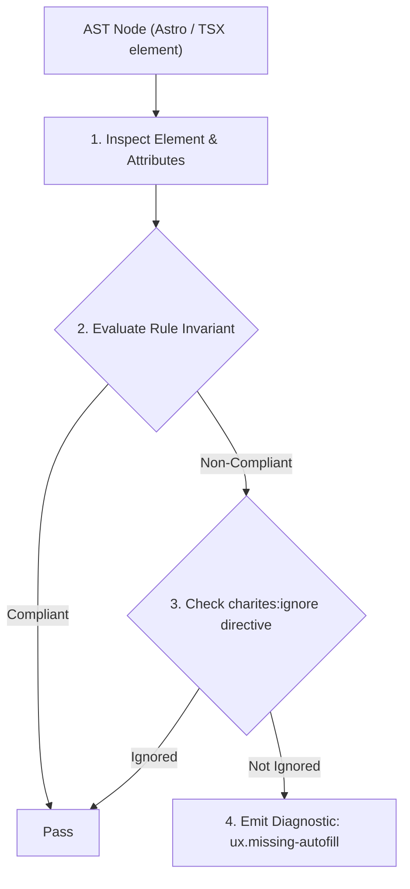
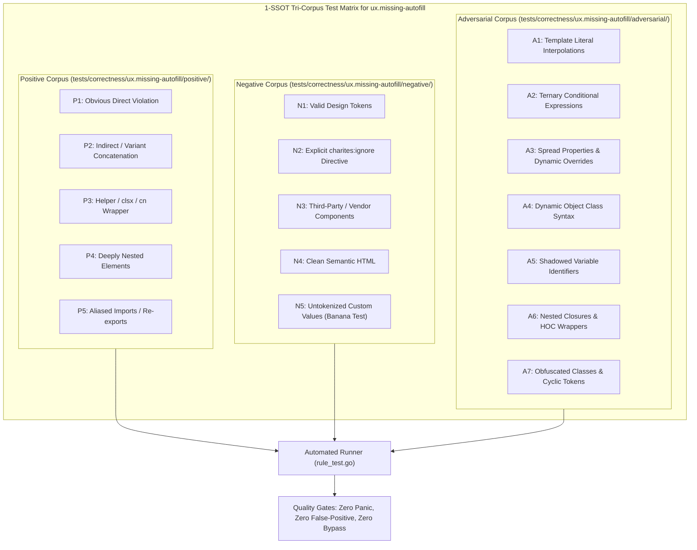

# ux.missing-autofill

> **Rule ID:** `ux.missing-autofill`
> **Severity:** `WARN`
> **Category:** `ux`
> **Target Standards:** HTML Living Standard Section 4.10.18.7 (Autofill / The autocomplete attribute), WCAG 2.2 Success Criterion 3.3.7 (Redundant Entry - Level A), Tesler's Law of Conservation of Complexity

---

## 1. Overview & Core Invariant

Enforces W3C Living Standard autocomplete attributes on personal identity, credential, and payment form inputs (Tesler's Law)

### Core Invariant:
> **"Form controls collecting Personally Identifiable Information (PII), authentication credentials, or financial payment details must declare valid HTML autocomplete attributes and never disable autofill on sensitive fields."**

---
## 2. Technical Grounding & Engine Realities

According to Tesler's Law, every application has an inherent amount of irreducible complexity. The design decision is whether the software absorbs this complexity or forces it upon the human user.

Entering email addresses, physical street addresses, telephone numbers, and generated complex passwords manually on every single website forces extreme cognitive friction and typing typos upon users. Modern browsers, OS keychains, and third-party password managers rely on standardized W3C 'autocomplete' tokens (e.g. 'current-password', 'new-password', 'email', 'tel', 'cc-number') to securely fill verified data.

Explicitly setting 'autocomplete="off"' on password or credit card fields is a severe antipattern that breaks password generation, encourages weak password reuse, and degrades account security.

---
## 3. Vulnerability & Risk Taxonomy

| Risk Vector | Severity | Impact |
| :--- | :---: | :--- |
| **Weak Password Reuse & Credential Hijacking** | HIGH | Blocking or omitting password autofill forces users to type passwords manually, leading to short, memorable, and easily cracked credentials. |
| **Form Abandonment & Redundant Data Entry Friction** | MEDIUM | Users abandon multi-field checkout and registration flows when forced to re-type address and phone details manually. |

---
## 4. Non-Compliant Code Patterns (Bad Examples)
### TSX (Password input lacking autocomplete attribute):
```tsx
<input
  type="password"
  name="password"
  placeholder="Masukkan kata sandi..."
  className="border rounded px-3 py-2"
/>
```
### ASTRO (Payment input explicitly disabling autocomplete):
```astro
<input
  type="text"
  name="cc-number"
  autocomplete="off"
  placeholder="Nomor Kartu Kredit"
  class="border rounded px-3 py-2"
/>
```

---
## 5. Compliant Implementation Patterns (Good Examples)
### TSX (Explicit current-password token assisting password managers):
```tsx
<input
  type="password"
  name="password"
  autoComplete="current-password"
  placeholder="Masukkan kata sandi..."
  className="border rounded px-3 py-2"
/>
```
### ASTRO (Compliant contact field with valid email autocomplete token):
```astro
<input
  type="email"
  name="user_email"
  autocomplete="email"
  placeholder="name@example.com"
  class="border rounded px-3 py-2"
/>
```

---

## 6. Detection & Verification Pipeline (How The Rule Evaluates Code)
This rule evaluates source code through the standard AST inspection pipeline:



### Step-by-Step Evaluation:
1. **AST Traversal:** Visits normalized `ir.Node` structures during AST streaming.
2. **Invariant Check:** Compares node attributes against rule invariants.
3. **Directive Suppression Check:** Honors inline `charites:ignore ux.missing-autofill` directives.
4. **Diagnostic Emission:** Emits compiler-grade diagnostic on invariant violation.

---

## 7. Verification & Test Harness (How The Test Works: 1-SSOT Tri-Corpus)

This rule is rigorously tested and validated across the canonical **1-SSOT Tri-Corpus** in `tests/correctness/ux.missing-autofill/`:



- **Positive Fixtures (P1-P5):** Verified to trigger diagnostics at exact lines and column spans.
- **Negative Fixtures (N1-N5):** Verified to produce zero diagnostics on valid tokens and legitimate exemptions.
- **Adversarial Fixtures (A1-A7):** Verified to prevent evasion across dynamic expressions, string interpolations, and cyclic references.

---

## 8. How to Suppress (Ignore Directives)

If this pattern is required for an intentional exception, suppress the diagnostic using the canonical Charites Rule ID:

```astro
<!-- charites:ignore ux.missing-autofill intentional exception -->
```

```tsx
// charites:ignore ux.missing-autofill intentional exception
```

---

## 9. Configuration Reference (`charites.yaml`)

```yaml
rules:
  ux.missing-autofill:
    severity: warn # error | warn | info | off
```

