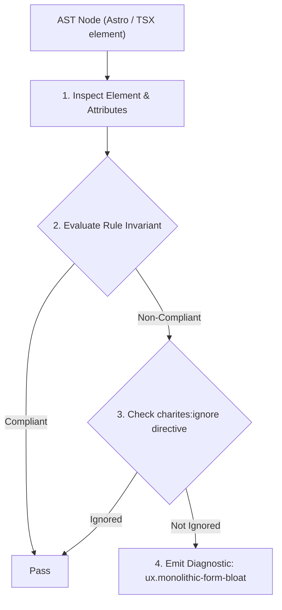
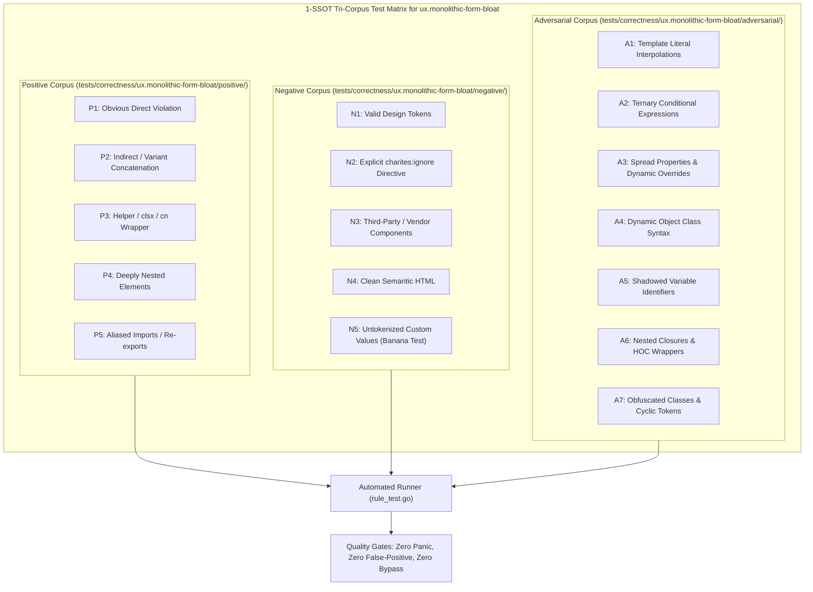

# ux.monolithic-form-bloat

> **Rule ID:** `ux.monolithic-form-bloat`
> **Severity:** `WARN`
> **Category:** `ux`
> **Target Standards:** Sweller's Cognitive Load Theory (Intrinsic & Germane Cognitive Load Management), Progressive Task Completion & Form Usability Principles (Wroblewski & Nielsen Norman Group), W3C WAI-ARIA Authoring Practices Guide (Form Landmark & Fieldset Segmentation)

---

## 1. Overview & Core Invariant

Warns when a monolithic form contains excessive unchunked inputs (> 9 total or > 7 per chunk), violating Cognitive Load Theory

### Core Invariant:
> **"Forms containing more than 9 total interactive fields must segment fields into chunks ('<fieldset>', Stepper, or Tabs), with no single chunk exceeding 7 fields."**

---
## 2. Technical Grounding & Engine Realities

Long, monolithic forms containing 10 or more unorganized inputs overload user working memory and generate psychological intimidation. According to Cognitive Load Theory, breaking complex information into manageable, cohesive chunks reduces task completion friction and error rates.

Forms must segment large input groups into semantic '<fieldset>' elements with explanatory '<legend>' titles, or utilize multi-step wizards ('<Stepper>', progressive tabs). Furthermore, each individual chunk must not exceed 7 active inputs to preserve perceptual focus.

---
## 3. Vulnerability & Risk Taxonomy

| Risk Vector | Severity | Impact |
| :--- | :---: | :--- |
| **Severe Form Abandonment** | MEDIUM | Users faced with tall, endless walls of inputs drop off significantly before completing registration or checkout flows. |
| **Field Omission & Data Entry Fatigue** | MEDIUM | Dense unchunked inputs cause users to overlook required fields, leading to repeated validation errors upon submission. |

---
## 4. Non-Compliant Code Patterns (Bad Examples)
### TSX (Monolithic form with 10 flat interactive inputs without fieldset or step chunking):
```tsx
<form onSubmit={handleSubmit} className="space-y-4 max-w-md">
  <input name="f1" placeholder="First Name" />
  <input name="f2" placeholder="Last Name" />
  <input name="f3" placeholder="Email" />
  <input name="f4" placeholder="Phone" />
  <input name="f5" placeholder="Address" />
  <input name="f6" placeholder="City" />
  <input name="f7" placeholder="State" />
  <input name="f8" placeholder="Zip Code" />
  <input name="f9" placeholder="Company" />
  <input name="f10" placeholder="Job Title" />
  <button type="submit">Kirim</button>
</form>
```

---
## 5. Compliant Implementation Patterns (Good Examples)
### TSX (Segmented into two semantic fieldsets with legends, keeping fields per chunk under 7):
```tsx
<form onSubmit={handleSubmit} className="space-y-6 max-w-md">
  <fieldset className="space-y-4 border p-4 rounded-lg">
    <legend className="font-semibold text-sm">Informasi Pribadi</legend>
    <input name="f1" placeholder="First Name" />
    <input name="f2" placeholder="Last Name" />
    <input name="f3" placeholder="Email" />
    <input name="f4" placeholder="Phone" />
  </fieldset>

  <fieldset className="space-y-4 border p-4 rounded-lg">
    <legend className="font-semibold text-sm">Alamat Pengiriman</legend>
    <input name="f5" placeholder="Address" />
    <input name="f6" placeholder="City" />
    <input name="f7" placeholder="State" />
    <input name="f8" placeholder="Zip Code" />
  </fieldset>

  <button type="submit">Kirim</button>
</form>
```

---

## 6. Detection & Verification Pipeline (How The Rule Evaluates Code)
This rule evaluates source code through the standard AST inspection pipeline:



### Step-by-Step Evaluation:
1. **AST Traversal:** Visits normalized `ir.Node` structures during AST streaming.
2. **Invariant Check:** Compares node attributes against rule invariants.
3. **Directive Suppression Check:** Honors inline `charites:ignore ux.monolithic-form-bloat` directives.
4. **Diagnostic Emission:** Emits compiler-grade diagnostic on invariant violation.

---

## 7. Verification & Test Harness (How The Test Works: 1-SSOT Tri-Corpus)

This rule is rigorously tested and validated across the canonical **1-SSOT Tri-Corpus** in `tests/correctness/ux.monolithic-form-bloat/`:



- **Positive Fixtures (P1-P5):** Verified to trigger diagnostics at exact lines and column spans.
- **Negative Fixtures (N1-N5):** Verified to produce zero diagnostics on valid tokens and legitimate exemptions.
- **Adversarial Fixtures (A1-A7):** Verified to prevent evasion across dynamic expressions, string interpolations, and cyclic references.

---

## 8. How to Suppress (Ignore Directives)

If this pattern is required for an intentional exception, suppress the diagnostic using the canonical Charites Rule ID:

```astro
<!-- charites:ignore ux.monolithic-form-bloat intentional exception -->
```

```tsx
// charites:ignore ux.monolithic-form-bloat intentional exception
```

---

## 9. Configuration Reference (`charites.yaml`)

```yaml
rules:
  ux.monolithic-form-bloat:
    severity: warn # error | warn | info | off
```

