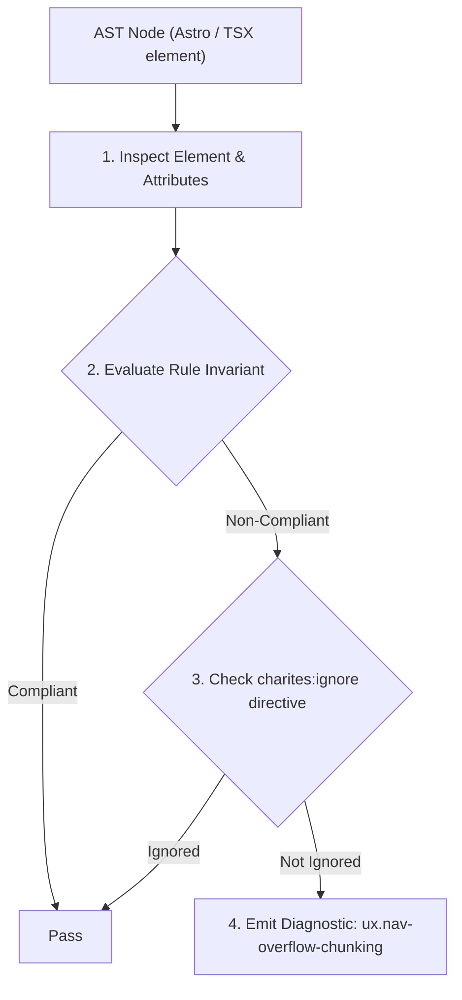
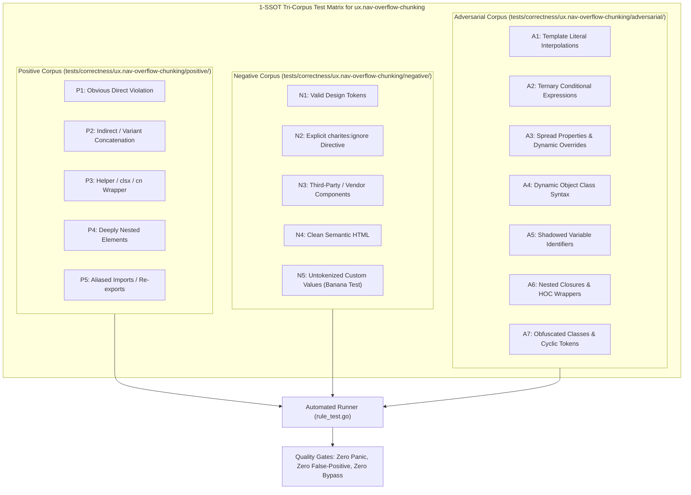

# ux.nav-overflow-chunking

> **Rule ID:** `ux.nav-overflow-chunking`
> **Severity:** `WARN`
> **Category:** `ux`
> **Target Standards:** Miller's Law (Information Processing Capacity: 7 ± 2 Chunks), Information Architecture Chunking & Category Hierarchy (Rosenfeld & Morville), W3C WAI-ARIA Authoring Practices Guide 1.2 (Navigation Menubars)

---

## 1. Overview & Core Invariant

Warns when a navigation landmark contains more than 7 direct navigation links without chunking mechanisms

### Core Invariant:
> **"Navigation landmarks ('<nav>' or 'role="navigation"') must not present more than 7 flat direct links without grouping into disclosures, dropdown menus, or category drawers."**

---
## 2. Technical Grounding & Engine Realities

Miller's Law dictates that human working memory can reliably retain only 7 ± 2 distinct chunks of information at any single time.

When a main navigation bar presents 8 or more flat links in a single row or list without visual or hierarchical chunking, users experience choice paralysis and elevated cognitive scan latency.

To maintain optimal information architecture, high-density menus should group secondary destinations into nested dropdowns, accordions, or an overflow 'More...' disclosure container.

---
## 3. Vulnerability & Risk Taxonomy

| Risk Vector | Severity | Impact |
| :--- | :---: | :--- |
| **Cognitive Overload & Choice Paralysis** | MEDIUM | Users take significantly longer to locate key navigation targets and frequently miss secondary features. |
| **Visual Clutter on Narrow Viewports** | MEDIUM | Flat multi-link navigation rows wrap awkwardly or cause accidental taps on mobile touchscreens. |

---
## 4. Non-Compliant Code Patterns (Bad Examples)
### TSX (Ten flat navigation links inside <nav> without grouping or overflow chunking):
```tsx
<nav className="flex gap-4">
  <a href="/home">Beranda</a>
  <a href="/profil">Profil</a>
  <a href="/layanan">Layanan</a>
  <a href="/berita">Berita</a>
  <a href="/transparansi">Transparansi</a>
  <a href="/anggaran">Anggaran</a>
  <a href="/regulasi">Regulasi</a>
  <a href="/galeri">Galeri</a>
  <a href="/kontak">Kontak</a>
  <a href="/bantuan">Bantuan</a>
</nav>
```

---
## 5. Compliant Implementation Patterns (Good Examples)
### TSX (Primary destinations kept to 4 links, with remaining links grouped into a DropdownMenu):
```tsx
<nav className="flex gap-4 items-center">
  <a href="/home">Beranda</a>
  <a href="/profil">Profil</a>
  <a href="/layanan">Layanan</a>
  <a href="/berita">Berita</a>
  <DropdownMenu>
    <button type="button" aria-expanded="false">Lainnya</button>
  </DropdownMenu>
</nav>
```

---

## 6. Detection & Verification Pipeline (How The Rule Evaluates Code)
This rule evaluates source code through the standard AST inspection pipeline:



### Step-by-Step Evaluation:
1. **AST Traversal:** Visits normalized `ir.Node` structures during AST streaming.
2. **Invariant Check:** Compares node attributes against rule invariants.
3. **Directive Suppression Check:** Honors inline `charites:ignore ux.nav-overflow-chunking` directives.
4. **Diagnostic Emission:** Emits compiler-grade diagnostic on invariant violation.

---

## 7. Verification & Test Harness (How The Test Works: 1-SSOT Tri-Corpus)

This rule is rigorously tested and validated across the canonical **1-SSOT Tri-Corpus** in `tests/correctness/ux.nav-overflow-chunking/`:



- **Positive Fixtures (P1-P5):** Verified to trigger diagnostics at exact lines and column spans.
- **Negative Fixtures (N1-N5):** Verified to produce zero diagnostics on valid tokens and legitimate exemptions.
- **Adversarial Fixtures (A1-A7):** Verified to prevent evasion across dynamic expressions, string interpolations, and cyclic references.

---

## 8. How to Suppress (Ignore Directives)

If this pattern is required for an intentional exception, suppress the diagnostic using the canonical Charites Rule ID:

```astro
<!-- charites:ignore ux.nav-overflow-chunking intentional exception -->
```

```tsx
// charites:ignore ux.nav-overflow-chunking intentional exception
```

---

## 9. Configuration Reference (`charites.yaml`)

```yaml
rules:
  ux.nav-overflow-chunking:
    severity: warn # error | warn | info | off
```

