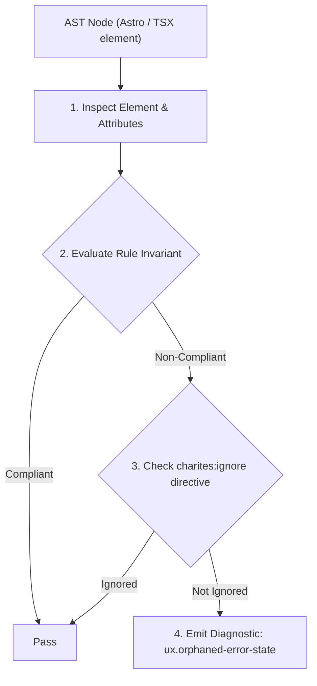
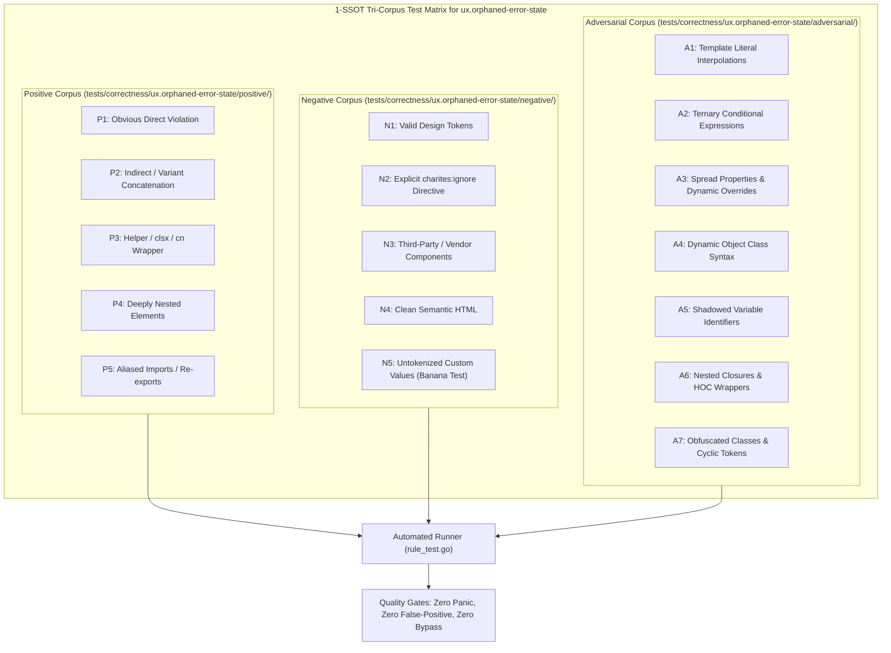

# ux.orphaned-error-state

> **Rule ID:** `ux.orphaned-error-state`
> **Severity:** `WARN`
> **Category:** `ux`
> **Target Standards:** Nielsen Heuristic #9: Help Users Recognize, Diagnose, and Recover from Errors, ISO 9241-110 Ergonomics of Human-System Interaction (Error Tolerance), WCAG 2.2 Success Criterion 3.3.1 (Error Identification)

---

## 1. Overview & Core Invariant

Flags error state updates in event handlers that lack corresponding UI error presentation elements

### Core Invariant:
> **"Validation error setters invoked in component handlers must have a corresponding error presentation element in the UI."**

---
## 2. Technical Grounding & Engine Realities

When client-side validation logic flags invalid input and updates internal component state (e.g. 'setEmailError("Format salah")'), that state must be surfaced to the user.

If the error state is never rendered in JSX or communicated via accessible error indicators, the form silently blocks submission while the user remains completely unaware of what went wrong.

---
## 3. Vulnerability & Risk Taxonomy

| Risk Vector | Severity | Impact |
| :--- | :---: | :--- |
| **Silent Submission Failure & Ghost Validation** | HIGH | Users submit forms that silently fail validation without displaying any error messages, causing confusion and frustration. |
| **Inaccessible Error Notification** | MEDIUM | Screen reader users and keyboard navigators receive no feedback when form constraints are violated. |

---
## 4. Non-Compliant Code Patterns (Bad Examples)
### TSX (Event handler updates error state but no error display exists in the JSX):
```tsx
export function LoginForm() {
  const [email, setEmail] = useState("");
  const [emailError, setEmailError] = useState("");

  const handleSubmit = (e) => {
    e.preventDefault();
    if (!email.includes("@")) {
      setEmailError("Format email tidak valid");
    }
  };

  return (
    <form onSubmit={handleSubmit} className="space-y-4">
      <input value={email} onChange={e => setEmail(e.target.value)} />
      <button type="submit">Masuk</button>
    </form>
  );
}
```

---
## 5. Compliant Implementation Patterns (Good Examples)
### TSX (Error state rendered visibly and accessibly with role='alert' and destructive color):
```tsx
export function LoginForm() {
  const [email, setEmail] = useState("");
  const [emailError, setEmailError] = useState("");

  const handleSubmit = (e) => {
    e.preventDefault();
    if (!email.includes("@")) {
      setEmailError("Format email tidak valid");
    }
  };

  return (
    <form onSubmit={handleSubmit} className="space-y-4">
      <input value={email} onChange={e => setEmail(e.target.value)} />
      {emailError && (
        <p role="alert" className="text-sm text-destructive font-medium">
          {emailError}
        </p>
      )}
      <button type="submit">Masuk</button>
    </form>
  );
}
```

---

## 6. Detection & Verification Pipeline (How The Rule Evaluates Code)
This rule evaluates source code through the standard AST inspection pipeline:



### Step-by-Step Evaluation:
1. **AST Traversal:** Visits normalized `ir.Node` structures during AST streaming.
2. **Invariant Check:** Compares node attributes against rule invariants.
3. **Directive Suppression Check:** Honors inline `charites:ignore ux.orphaned-error-state` directives.
4. **Diagnostic Emission:** Emits compiler-grade diagnostic on invariant violation.

---

## 7. Verification & Test Harness (How The Test Works: 1-SSOT Tri-Corpus)

This rule is rigorously tested and validated across the canonical **1-SSOT Tri-Corpus** in `tests/correctness/ux.orphaned-error-state/`:



- **Positive Fixtures (P1-P5):** Verified to trigger diagnostics at exact lines and column spans.
- **Negative Fixtures (N1-N5):** Verified to produce zero diagnostics on valid tokens and legitimate exemptions.
- **Adversarial Fixtures (A1-A7):** Verified to prevent evasion across dynamic expressions, string interpolations, and cyclic references.

---

## 8. How to Suppress (Ignore Directives)

If this pattern is required for an intentional exception, suppress the diagnostic using the canonical Charites Rule ID:

```astro
<!-- charites:ignore ux.orphaned-error-state intentional exception -->
```

```tsx
// charites:ignore ux.orphaned-error-state intentional exception
```

---

## 9. Configuration Reference (`charites.yaml`)

```yaml
rules:
  ux.orphaned-error-state:
    severity: warn # error | warn | info | off
```

