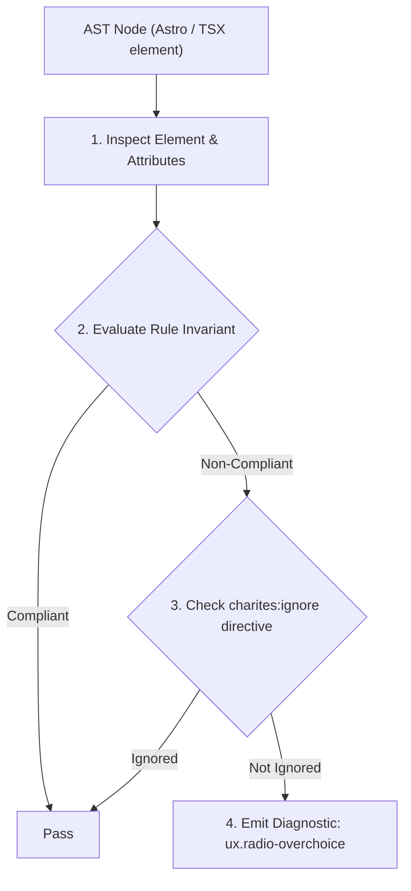
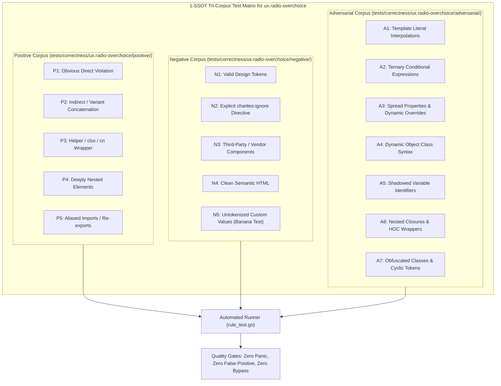

# ux.radio-overchoice

> **Rule ID:** `ux.radio-overchoice`
> **Severity:** `WARN`
> **Category:** `ux`
> **Target Standards:** Hick-Hyman Law of Decision Latency (Reaction Time T = b * log2(n + 1)), W3C WAI-ARIA Authoring Practices Guide 1.2 (Radio Group Design Pattern), Nielsen Norman Group Guidelines on Selection Controls (Radio Buttons vs Dropdown Menus)

---

## 1. Overview & Core Invariant

Warns when radio groups present excessive flat options (> 7) without filtering or combobox grouping, violating Hick-Hyman Law

### Core Invariant:
> **"Radio groups sharing the same name or contained within a '<RadioGroup>' must not present more than 7 flat unsearchable options without filter mechanisms or combobox grouping."**

---
## 2. Technical Grounding & Engine Realities

The Hick-Hyman Law mathematically models cognitive choice reaction time as a logarithmic function of the number of options presented. Radio buttons are optimized for rapid, mutually exclusive scanning when choices are few (2 to 4 options).

When developers present 8 or more flat radio buttons (e.g. selecting from 34 provinces or 50 states), users must visually inspect every single choice sequentially. This drastically inflates interaction latency and induces decision paralysis. For option counts exceeding 7, a searchable '<Combobox>' or grouped dropdown '<Select>' is strongly mandated.

---
## 3. Vulnerability & Risk Taxonomy

| Risk Vector | Severity | Impact |
| :--- | :---: | :--- |
| **Decision Paralysis & Extended Scan Latency** | MEDIUM | Users experience substantial friction locating their desired choice among dozens of unstructured radio options. |
| **Excessive Vertical Viewport Consumption** | MEDIUM | Long lists of vertical radio items force extensive scrolling on mobile screens, pushing submit buttons out of view. |

---
## 4. Non-Compliant Code Patterns (Bad Examples)
### TSX (Ten flat radio buttons in a group without filtering or select abstraction):
```tsx
<div className="space-y-2">
  <label className="text-sm font-semibold">Pilih Wilayah Kerja</label>
  <input type="radio" name="region" value="reg-1" /> Wilayah 1
  <input type="radio" name="region" value="reg-2" /> Wilayah 2
  <input type="radio" name="region" value="reg-3" /> Wilayah 3
  <input type="radio" name="region" value="reg-4" /> Wilayah 4
  <input type="radio" name="region" value="reg-5" /> Wilayah 5
  <input type="radio" name="region" value="reg-6" /> Wilayah 6
  <input type="radio" name="region" value="reg-7" /> Wilayah 7
  <input type="radio" name="region" value="reg-8" /> Wilayah 8
  <input type="radio" name="region" value="reg-9" /> Wilayah 9
  <input type="radio" name="region" value="reg-10" /> Wilayah 10
</div>
```

---
## 5. Compliant Implementation Patterns (Good Examples)
### TSX (Searchable Combobox for large dataset, keeping cognitive load low):
```tsx
<div className="space-y-2">
  <label className="text-sm font-semibold">Pilih Wilayah Kerja</label>
  <Combobox
    options={regionOptions}
    placeholder="Cari atau pilih wilayah..."
    searchable
  />
</div>
```
### TSX (Compact radio group with 3 clear, distinct choices adhering to Hick-Hyman Law):
```tsx
<RadioGroup name="billing_cycle" className="flex gap-4">
  <RadioGroupItem value="monthly" label="Bulanan" />
  <RadioGroupItem value="annual" label="Tahunan (Hemat 20%)" />
  <RadioGroupItem value="lifetime" label="Seumur Hidup" />
</RadioGroup>
```

---

## 6. Detection & Verification Pipeline (How The Rule Evaluates Code)
This rule evaluates source code through the standard AST inspection pipeline:



### Step-by-Step Evaluation:
1. **AST Traversal:** Visits normalized `ir.Node` structures during AST streaming.
2. **Invariant Check:** Compares node attributes against rule invariants.
3. **Directive Suppression Check:** Honors inline `charites:ignore ux.radio-overchoice` directives.
4. **Diagnostic Emission:** Emits compiler-grade diagnostic on invariant violation.

---

## 7. Verification & Test Harness (How The Test Works: 1-SSOT Tri-Corpus)

This rule is rigorously tested and validated across the canonical **1-SSOT Tri-Corpus** in `tests/correctness/ux.radio-overchoice/`:



- **Positive Fixtures (P1-P5):** Verified to trigger diagnostics at exact lines and column spans.
- **Negative Fixtures (N1-N5):** Verified to produce zero diagnostics on valid tokens and legitimate exemptions.
- **Adversarial Fixtures (A1-A7):** Verified to prevent evasion across dynamic expressions, string interpolations, and cyclic references.

---

## 8. How to Suppress (Ignore Directives)

If this pattern is required for an intentional exception, suppress the diagnostic using the canonical Charites Rule ID:

```astro
<!-- charites:ignore ux.radio-overchoice intentional exception -->
```

```tsx
// charites:ignore ux.radio-overchoice intentional exception
```

---

## 9. Configuration Reference (`charites.yaml`)

```yaml
rules:
  ux.radio-overchoice:
    severity: warn # error | warn | info | off
```

