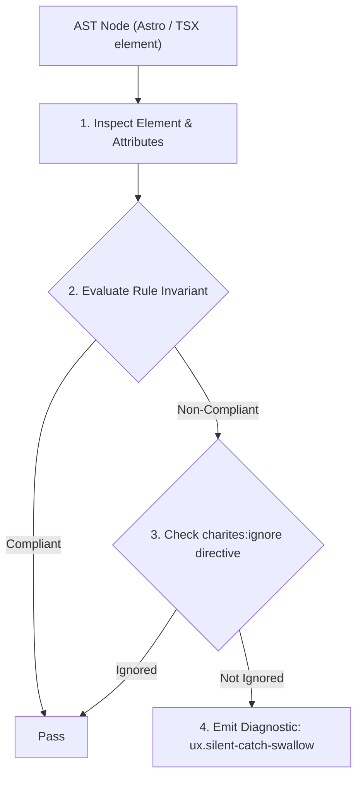
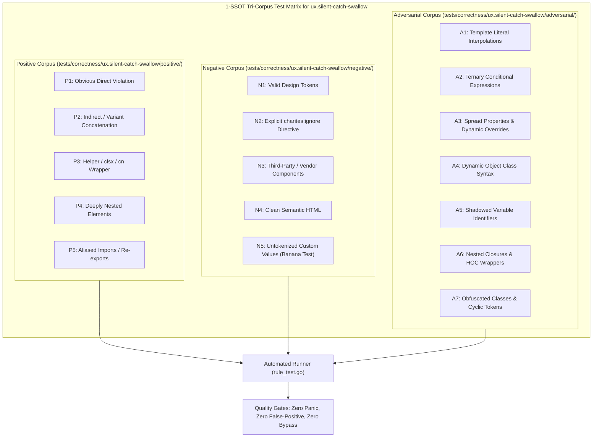

# ux.silent-catch-swallow

> **Rule ID:** `ux.silent-catch-swallow`
> **Severity:** `ERROR`
> **Category:** `ux`
> **Target Standards:** Nielsen Heuristic #9: Help Users Recognize, Diagnose, and Recover from Errors, ISO 9241-110 Ergonomics of Human-System Interaction (Error Management), Zero-Trust Error Transparency Guidelines

---

## 1. Overview & Core Invariant

Detects swallowed catch blocks in event handlers that lack user feedback (toast/alert) or re-throw

### Core Invariant:
> **"Catch blocks in user interaction handlers must provide visible UI feedback ('toast', error state, alert) or re-throw the error."**

---
## 2. Technical Grounding & Engine Realities

When user interaction handlers catch exceptions and only log them to 'console.log' or discard them entirely, the failure is silently swallowed.

The user receives no feedback, falsely assumes their changes were saved, and navigates away, only to discover later that critical data was lost. Surfacing visible feedback (e.g. 'toast.error(...)', 'setError(...)', or banner notifications) guarantees that errors are transparent, allowing users to understand the problem and re-attempt the action.

---
## 3. Vulnerability & Risk Taxonomy

| Risk Vector | Severity | Impact |
| :--- | :---: | :--- |
| **Silent Data Loss & False Sense of Completion** | HIGH | Users believe changes succeeded when they actually failed on the network, leading to unrecoverable data loss. |
| **Lack of Failure Diagnostics** | MEDIUM | Users cannot self-diagnose network errors or invalid parameters, resulting in confusion and support tickets. |

---
## 4. Non-Compliant Code Patterns (Bad Examples)
### TSX (Catch block silently logging to console without notifying the user):
```tsx
<button
  onClick={async () => {
    try {
      await api.updateProfile(formData);
    } catch (e) {
      console.error(e); // Pengguna tidak tahu aksinya gagal!
    }
  }}
>
  Simpan Profil
</button>
```

---
## 5. Compliant Implementation Patterns (Good Examples)
### TSX (Catch block notifying user with a toast error notification):
```tsx
<button
  onClick={async () => {
    try {
      await api.updateProfile(formData);
    } catch (e) {
      toast.error("Gagal memperbarui profil. Silakan coba lagi.");
    }
  }}
>
  Simpan Profil
</button>
```

---

## 6. Detection & Verification Pipeline (How The Rule Evaluates Code)
This rule evaluates source code through the standard AST inspection pipeline:



### Step-by-Step Evaluation:
1. **AST Traversal:** Visits normalized `ir.Node` structures during AST streaming.
2. **Invariant Check:** Compares node attributes against rule invariants.
3. **Directive Suppression Check:** Honors inline `charites:ignore ux.silent-catch-swallow` directives.
4. **Diagnostic Emission:** Emits compiler-grade diagnostic on invariant violation.

---

## 7. Verification & Test Harness (How The Test Works: 1-SSOT Tri-Corpus)

This rule is rigorously tested and validated across the canonical **1-SSOT Tri-Corpus** in `tests/correctness/ux.silent-catch-swallow/`:



- **Positive Fixtures (P1-P5):** Verified to trigger diagnostics at exact lines and column spans.
- **Negative Fixtures (N1-N5):** Verified to produce zero diagnostics on valid tokens and legitimate exemptions.
- **Adversarial Fixtures (A1-A7):** Verified to prevent evasion across dynamic expressions, string interpolations, and cyclic references.

---

## 8. How to Suppress (Ignore Directives)

If this pattern is required for an intentional exception, suppress the diagnostic using the canonical Charites Rule ID:

```astro
<!-- charites:ignore ux.silent-catch-swallow intentional exception -->
```

```tsx
// charites:ignore ux.silent-catch-swallow intentional exception
```

---

## 9. Configuration Reference (`charites.yaml`)

```yaml
rules:
  ux.silent-catch-swallow:
    severity: error # error | warn | info | off
```

