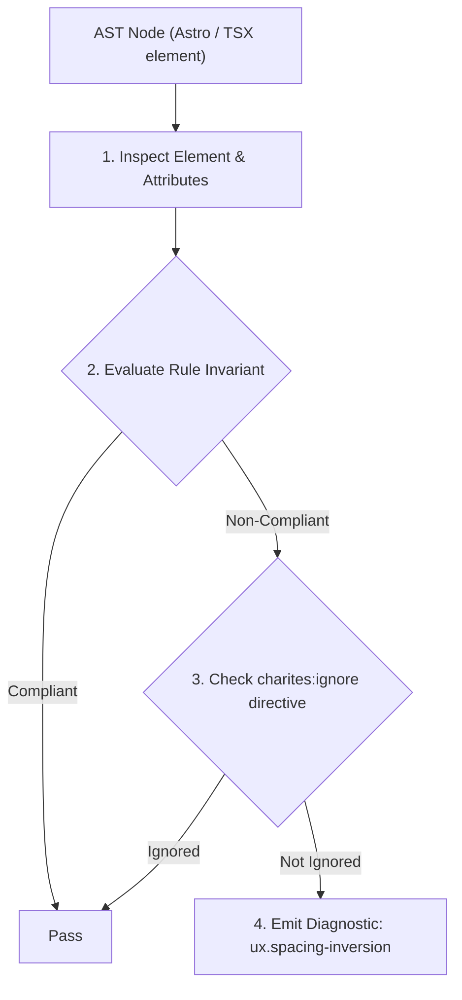
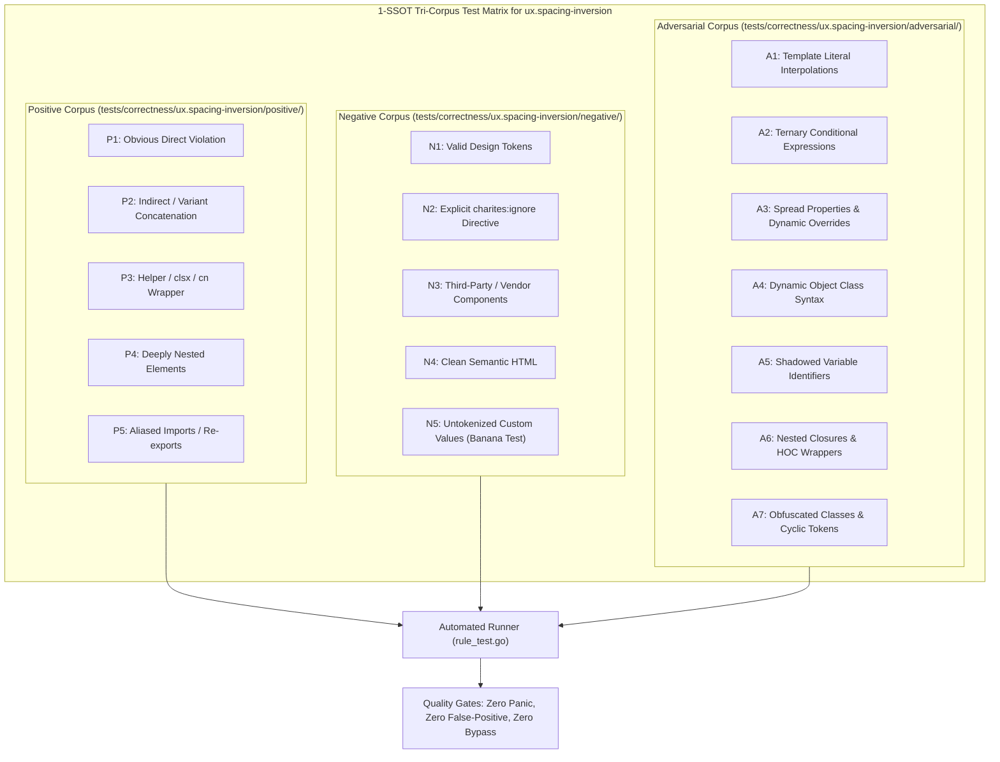

# ux.spacing-inversion

> **Rule ID:** `ux.spacing-inversion`
> **Severity:** `WARN`
> **Category:** `ux`
> **Target Standards:** Gestalt Law of Proximity (Visual Perceptual Hierarchy), Tailwind CSS v3 Space-Between Sibling Selector Specificity Quirks, W3C Design Tokens Community Group (DTCG v2025.10 - Spatial Scale)

---

## 1. Overview & Core Invariant

Warns when child element intra-spacing exceeds parent gap or when space-y conflicts with child mt margin in Tailwind v3

### Core Invariant:
> **"Child element intra-spacing must be strictly tighter than the inter-element gap separating parent sibling groups, and parent 'space-y-*' must not conflict with child 'mt-*' overrides."**

---
## 2. Technical Grounding & Engine Realities

According to the Gestalt Law of Proximity, elements that belong to the same logical group must have smaller internal spacing than the boundary gap between distinct sibling groups.

When a child card or section applies an internal margin or gap that is larger than or equal to the parent container's gap (e.g., parent has 'space-y-4' while child has 'mb-8'), the visual cohesion dissolves, confusing users about which headings, texts, or actions belong together.

Furthermore, in Tailwind CSS v3, 'space-y-*' generates a complex sibling selector '> :not([hidden]) ~ :not([hidden])' with specificity (0, 3, 0), which silently overrides any child 'mt-*' utility (0, 1, 0) without a compiler error. Switching the parent to 'flex flex-col gap-*' restores deterministic CSS cascade and spatial clarity.

---
## 3. Vulnerability & Risk Taxonomy

| Risk Vector | Severity | Impact |
| :--- | :---: | :--- |
| **Cognitive Grouping Disruption** | MEDIUM | Users misattribute subheadings and actions to unrelated neighbouring cards due to broken proximity cues. |
| **Silent CSS Specificity Override** | MEDIUM | Tailwind v3 sibling selectors override child margins without error, leading to unintended layout shifts. |

---
## 4. Non-Compliant Code Patterns (Bad Examples)
### TSX (Parent uses space-y-4 while child card specifies mb-8, causing Gestalt proximity inversion and v3 specificity clash):
```tsx
<section className="space-y-4">
  <div className="mb-8">
    <h3 className="text-sm font-semibold">Grup A</h3>
  </div>
  <div className="mb-8">
    <h3 className="text-sm font-semibold">Grup B</h3>
  </div>
</section>
```

---
## 5. Compliant Implementation Patterns (Good Examples)
### TSX (Parent sets wider gap-8 separating groups, while child maintains tighter mb-3 intra-spacing):
```tsx
<section className="flex flex-col gap-8">
  <div className="mb-3">
    <h3 className="text-sm font-semibold">Grup A</h3>
  </div>
  <div className="mb-3">
    <h3 className="text-sm font-semibold">Grup B</h3>
  </div>
</section>
```

---

## 6. Detection & Verification Pipeline (How The Rule Evaluates Code)
This rule evaluates source code through the standard AST inspection pipeline:



### Step-by-Step Evaluation:
1. **AST Traversal:** Visits normalized `ir.Node` structures during AST streaming.
2. **Invariant Check:** Compares node attributes against rule invariants.
3. **Directive Suppression Check:** Honors inline `charites:ignore ux.spacing-inversion` directives.
4. **Diagnostic Emission:** Emits compiler-grade diagnostic on invariant violation.

---

## 7. Verification & Test Harness (How The Test Works: 1-SSOT Tri-Corpus)

This rule is rigorously tested and validated across the canonical **1-SSOT Tri-Corpus** in `tests/correctness/ux.spacing-inversion/`:



- **Positive Fixtures (P1-P5):** Verified to trigger diagnostics at exact lines and column spans.
- **Negative Fixtures (N1-N5):** Verified to produce zero diagnostics on valid tokens and legitimate exemptions.
- **Adversarial Fixtures (A1-A7):** Verified to prevent evasion across dynamic expressions, string interpolations, and cyclic references.

---

## 8. How to Suppress (Ignore Directives)

If this pattern is required for an intentional exception, suppress the diagnostic using the canonical Charites Rule ID:

```astro
<!-- charites:ignore ux.spacing-inversion intentional exception -->
```

```tsx
// charites:ignore ux.spacing-inversion intentional exception
```

---

## 9. Configuration Reference (`charites.yaml`)

```yaml
rules:
  ux.spacing-inversion:
    severity: warn # error | warn | info | off
```

