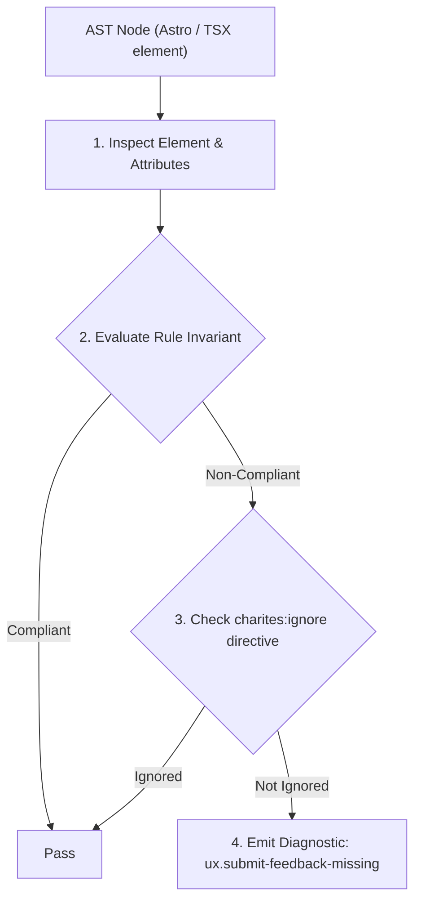
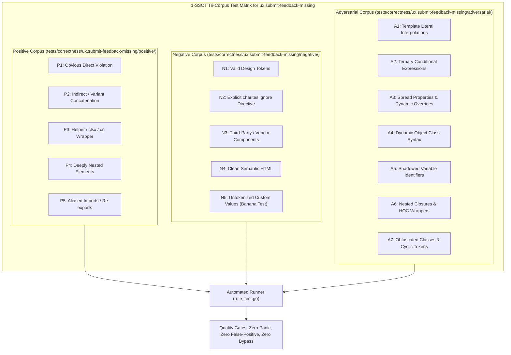

# ux.submit-feedback-missing

> **Rule ID:** `ux.submit-feedback-missing`
> **Severity:** `WARN`
> **Category:** `ux`
> **Target Standards:** Doherty Threshold (< 400ms Interaction Feedback), Nielsen Heuristic #1: Visibility of System Status, ISO 9241-110 Ergonomics of Human-System Interaction (Self-Descriptiveness)

---

## 1. Overview & Core Invariant

Enforces reentry guard (disabled) and perceivable feedback (aria-busy/spinner) on async mutation triggers

### Core Invariant:
> **"Async mutation triggers must provide both Reentry Guard (R1: 'disabled={isPending}') and Perceivable Feedback (R2: 'aria-busy' or spinner)."**

---
## 2. Technical Grounding & Engine Realities

When users trigger a mutation (such as submitting an order or charging a payment) without immediate feedback, they perceive the system as unresponsive within the 400ms Doherty Threshold.

In the absence of a reentry lock, users repeatedly click the submit button, triggering duplicate requests, double financial charges, and server-side race conditions. Enforcing both R1 (reentry lockout) and R2 (visual feedback) guarantees transactional safety and cognitive assurance.

---
## 3. Vulnerability & Risk Taxonomy

| Risk Vector | Severity | Impact |
| :--- | :---: | :--- |
| **Duplicate Submissions & Double Charging** | HIGH | Rapid repeated clicks by uncertain users cause duplicate database inserts and multiple payment gateway captures. |
| **Cognitive Disorientation & Interaction Rage** | MEDIUM | Users doubt whether their input registered, leading to rage clicks and workflow cancellation. |

---
## 4. Non-Compliant Code Patterns (Bad Examples)
### TSX (Async submit button without disabling control or showing pending feedback):
```tsx
<button
  onClick={async () => {
    await api.post("/orders", orderData);
  }}
  className="bg-primary text-white px-4 py-2"
>
  Bayar Sekarang
</button>
```

---
## 5. Compliant Implementation Patterns (Good Examples)
### TSX (Compliant button satisfying R1 (disabled={isPending}) and R2 (aria-busy & dynamic text)):
```tsx
<button
  onClick={handlePayment}
  disabled={isPending}
  aria-busy={isPending}
  className="bg-primary text-white px-4 py-2 disabled:opacity-50"
>
  {isPending ? "Memproses Pembayaran..." : "Bayar Sekarang"}
</button>
```

---

## 6. Detection & Verification Pipeline (How The Rule Evaluates Code)
This rule evaluates source code through the standard AST inspection pipeline:



### Step-by-Step Evaluation:
1. **AST Traversal:** Visits normalized `ir.Node` structures during AST streaming.
2. **Invariant Check:** Compares node attributes against rule invariants.
3. **Directive Suppression Check:** Honors inline `charites:ignore ux.submit-feedback-missing` directives.
4. **Diagnostic Emission:** Emits compiler-grade diagnostic on invariant violation.

---

## 7. Verification & Test Harness (How The Test Works: 1-SSOT Tri-Corpus)

This rule is rigorously tested and validated across the canonical **1-SSOT Tri-Corpus** in `tests/correctness/ux.submit-feedback-missing/`:



- **Positive Fixtures (P1-P5):** Verified to trigger diagnostics at exact lines and column spans.
- **Negative Fixtures (N1-N5):** Verified to produce zero diagnostics on valid tokens and legitimate exemptions.
- **Adversarial Fixtures (A1-A7):** Verified to prevent evasion across dynamic expressions, string interpolations, and cyclic references.

---

## 8. How to Suppress (Ignore Directives)

If this pattern is required for an intentional exception, suppress the diagnostic using the canonical Charites Rule ID:

```astro
<!-- charites:ignore ux.submit-feedback-missing intentional exception -->
```

```tsx
// charites:ignore ux.submit-feedback-missing intentional exception
```

---

## 9. Configuration Reference (`charites.yaml`)

```yaml
rules:
  ux.submit-feedback-missing:
    severity: warn # error | warn | info | off
```

