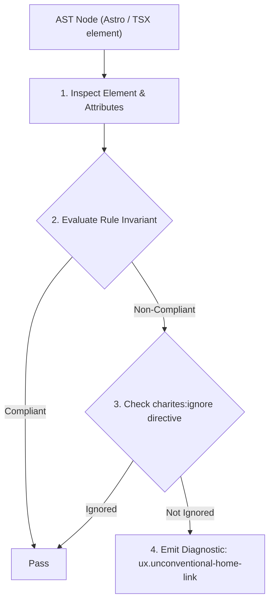
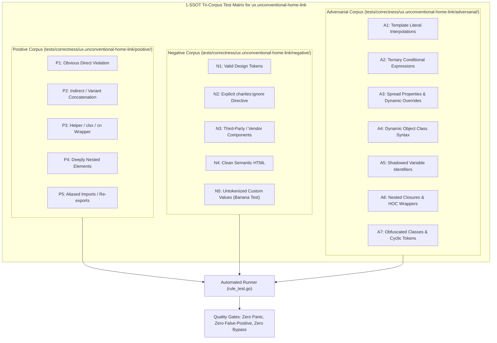

# ux.unconventional-home-link

> **Rule ID:** `ux.unconventional-home-link`
> **Severity:** `WARN`
> **Category:** `ux`
> **Target Standards:** Jakob's Law of Internet User Experience (Nielsen Norman Group), W3C Web Navigation & Landmark Architecture Guidelines, ISO 9241-110 Ergonomics of Human-System Interaction (Suitability for Learning & Predictability)

---

## 1. Overview & Core Invariant

Enforces Jakob's Law by ensuring header logo/brand identity links to the root home page ('/')

### Core Invariant:
> **"Brand identity and logo elements in the primary header must be enclosed within an anchor ('<a>' or '<Link>') whose destination normalizes to the root homepage ('/')."**

---
## 2. Technical Grounding & Engine Realities

Jakob's Law states that users spend most of their time on sites other than yours. Consequently, they bring deeply ingrained mental models about standard interaction patterns. The most universal web convention is that clicking the brand logo in the top-left header returns to the homepage ('/').

When a logo is unclickable, rendered as a passive image or plain text, or links to an unexpected secondary destination (like /about, /products, or an external portal), users become disoriented and lose their primary visual escape hatch back to the system root.

---
## 3. Vulnerability & Risk Taxonomy

| Risk Vector | Severity | Impact |
| :--- | :---: | :--- |
| **Mental Model Disorientation** | MEDIUM | Users habitually click the top-left brand mark when seeking the homepage; non-functional or diverted logos induce frustration and cognitive friction. |
| **Accidental Site Exit or Dead End** | LOW | Navigating away from the root application when attempting to reset context forces users to rely on browser history or address bar edits. |

---
## 4. Non-Compliant Code Patterns (Bad Examples)
### TSX (Passive brand logo in header without any enclosing link):
```tsx
<header className="flex items-center justify-between px-6 py-4 border-b">
  
  <nav className="flex gap-4">
    <a href="/features">Features</a>
    <a href="/pricing">Pricing</a>
  </nav>
</header>
```
### ASTRO (Brand logo linking to an internal sub-page instead of root):
```astro
<header class="flex items-center justify-between px-6 py-4">
  <a href="/about" class="brand-logo flex items-center gap-2">
    
    <span class="font-bold">Portal</span>
  </a>
</header>
```

---
## 5. Compliant Implementation Patterns (Good Examples)
### TSX (Brand logo wrapped in accessible anchor linking directly to root '/'):
```tsx
<header className="flex items-center justify-between px-6 py-4 border-b">
  <a href="/" aria-label="Acme Corporation - Beranda" className="flex items-center gap-2">
    
    <span className="font-bold text-lg">Acme</span>
  </a>
  <nav className="flex gap-4">
    <a href="/features">Features</a>
  </nav>
</header>
```

---

## 6. Detection & Verification Pipeline (How The Rule Evaluates Code)
This rule evaluates source code through the standard AST inspection pipeline:



### Step-by-Step Evaluation:
1. **AST Traversal:** Visits normalized `ir.Node` structures during AST streaming.
2. **Invariant Check:** Compares node attributes against rule invariants.
3. **Directive Suppression Check:** Honors inline `charites:ignore ux.unconventional-home-link` directives.
4. **Diagnostic Emission:** Emits compiler-grade diagnostic on invariant violation.

---

## 7. Verification & Test Harness (How The Test Works: 1-SSOT Tri-Corpus)

This rule is rigorously tested and validated across the canonical **1-SSOT Tri-Corpus** in `tests/correctness/ux.unconventional-home-link/`:



- **Positive Fixtures (P1-P5):** Verified to trigger diagnostics at exact lines and column spans.
- **Negative Fixtures (N1-N5):** Verified to produce zero diagnostics on valid tokens and legitimate exemptions.
- **Adversarial Fixtures (A1-A7):** Verified to prevent evasion across dynamic expressions, string interpolations, and cyclic references.

---

## 8. How to Suppress (Ignore Directives)

If this pattern is required for an intentional exception, suppress the diagnostic using the canonical Charites Rule ID:

```astro
<!-- charites:ignore ux.unconventional-home-link intentional exception -->
```

```tsx
// charites:ignore ux.unconventional-home-link intentional exception
```

---

## 9. Configuration Reference (`charites.yaml`)

```yaml
rules:
  ux.unconventional-home-link:
    severity: warn # error | warn | info | off
```

