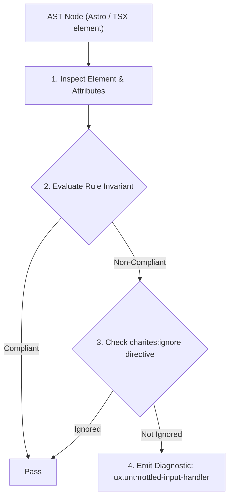
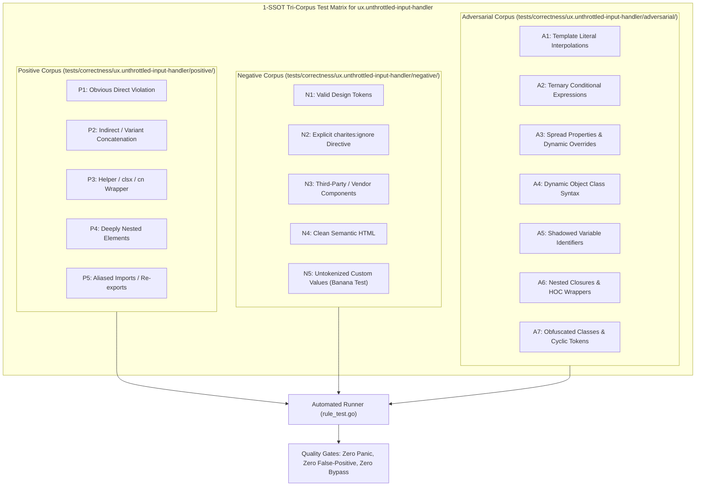

# ux.unthrottled-input-handler

> **Rule ID:** `ux.unthrottled-input-handler`
> **Severity:** `WARN`
> **Category:** `ux`
> **Target Standards:** Perceptual Stability & Doherty Threshold (< 400ms), Nielsen Norman Group: Response Times (The 3 Important Limits), WCAG 2.2 Success Criterion 2.2.4 (Interruptions)

---

## 1. Overview & Core Invariant

Flags text input handlers that trigger unthrottled network calls directly on keystrokes

### Core Invariant:
> **"Text input handlers ('onChange', 'onInput') must not trigger direct network requests without debounce or throttle protection."**

---
## 2. Technical Grounding & Engine Realities

Firing network requests on every single keystroke floods the network with redundant in-flight calls, causes race conditions where earlier responses overwrite newer ones (out-of-order responses), and produces aggressive layout thrashing / UI jitter as suggestion dropdowns flicker erratically.

Wrapping handlers in a 250-400ms debounce buffer (or throttle) stabilizes perceptual performance, dramatically reduces server load, and guarantees that search results correspond to the user's finalized query.

---
## 3. Vulnerability & Risk Taxonomy

| Risk Vector | Severity | Impact |
| :--- | :---: | :--- |
| **Out-of-Order Race Conditions & Stale UI** | HIGH | Slow earlier network responses resolve after fast later responses, showing stale search results for an old keystroke. |
| **UI Jitter & Layout Thrashing** | MEDIUM | Rapid re-rendering of dropdown popovers on each keystroke causes visual stutter and jarring jumps. |

---
## 4. Non-Compliant Code Patterns (Bad Examples)
### TSX (Direct unthrottled fetch call inside onChange input handler):
```tsx
<div className="relative">
  <input
    type="search"
    placeholder="Cari produk..."
    onChange={e => fetchSuggestions(e.target.value)}
    className="w-full px-4 py-2 border rounded"
  />
</div>
```

---
## 5. Compliant Implementation Patterns (Good Examples)
### TSX (Debounced handler buffer (300ms) prior to triggering network search):
```tsx
const debouncedSearch = useDebouncedCallback((query: string) => {
  fetchSuggestions(query);
}, 300);

<div className="relative">
  <input
    type="search"
    placeholder="Cari produk..."
    onChange={e => debouncedSearch(e.target.value)}
    className="w-full px-4 py-2 border rounded"
  />
</div>
```

---

## 6. Detection & Verification Pipeline (How The Rule Evaluates Code)
This rule evaluates source code through the standard AST inspection pipeline:



### Step-by-Step Evaluation:
1. **AST Traversal:** Visits normalized `ir.Node` structures during AST streaming.
2. **Invariant Check:** Compares node attributes against rule invariants.
3. **Directive Suppression Check:** Honors inline `charites:ignore ux.unthrottled-input-handler` directives.
4. **Diagnostic Emission:** Emits compiler-grade diagnostic on invariant violation.

---

## 7. Verification & Test Harness (How The Test Works: 1-SSOT Tri-Corpus)

This rule is rigorously tested and validated across the canonical **1-SSOT Tri-Corpus** in `tests/correctness/ux.unthrottled-input-handler/`:



- **Positive Fixtures (P1-P5):** Verified to trigger diagnostics at exact lines and column spans.
- **Negative Fixtures (N1-N5):** Verified to produce zero diagnostics on valid tokens and legitimate exemptions.
- **Adversarial Fixtures (A1-A7):** Verified to prevent evasion across dynamic expressions, string interpolations, and cyclic references.

---

## 8. How to Suppress (Ignore Directives)

If this pattern is required for an intentional exception, suppress the diagnostic using the canonical Charites Rule ID:

```astro
<!-- charites:ignore ux.unthrottled-input-handler intentional exception -->
```

```tsx
// charites:ignore ux.unthrottled-input-handler intentional exception
```

---

## 9. Configuration Reference (`charites.yaml`)

```yaml
rules:
  ux.unthrottled-input-handler:
    severity: warn # error | warn | info | off
```

